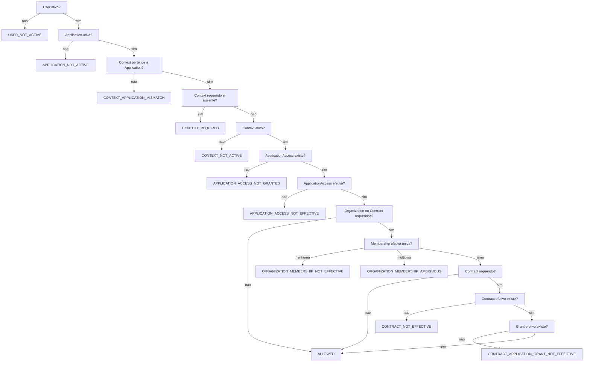

# Avaliacao de entrada em aplicacao CORE

Este documento define a capability read-only que decide se um `User` CORE pode entrar em uma `Application` e, quando aplicavel, em um `ApplicationContext`.

## Responsabilidade

`EvaluateApplicationEntry` avalia direito global de entrada no ecossistema.

Inclui:

- estado global do usuario;
- estado da aplicacao;
- estado e compatibilidade do contexto;
- `ApplicationAccess` individual;
- requirements de organizacao e contrato;
- `OrganizationMembership` efetiva;
- `Contract` efetivo;
- `ContractApplicationGrant` efetivo.

O ciclo de vida e a resolucao temporal de `ApplicationAccess` estao detalhados em `docs/architecture/core-application-access-lifecycle.md`.

Exclui:

- login;
- OAuth/OIDC;
- roles, permissions, abilities, Gates e Policies operacionais;
- regras de workflow de aplicacoes;
- auditoria, cache, eventos e persistencia da decisao.

## Entrada

A avaliacao recebe explicitamente:

- `User`;
- `Application`;
- `ApplicationContext` opcional;
- instante de avaliacao.

O instante e parte do contrato para tornar a decisao deterministica e testavel. A capability nao chama `now()` internamente.

## Decisao

A saida e `ApplicationEntryDecision`, um objeto imutavel com:

- `allowed`: booleano;
- `reason`: `ApplicationEntryReason`.

A decisao nao retorna dump de Models, SQL, metadata generica nem mensagem traduzida. Traducoes pertencem a UI/API futura.

## Reason codes

Catalogo fechado:

- `ALLOWED`
- `USER_NOT_ACTIVE`
- `APPLICATION_NOT_ACTIVE`
- `CONTEXT_REQUIRED`
- `CONTEXT_NOT_ACTIVE`
- `CONTEXT_APPLICATION_MISMATCH`
- `APPLICATION_ACCESS_NOT_GRANTED`
- `APPLICATION_ACCESS_NOT_EFFECTIVE`
- `ORGANIZATION_REQUIRED`
- `ORGANIZATION_MEMBERSHIP_NOT_EFFECTIVE`
- `ORGANIZATION_MEMBERSHIP_AMBIGUOUS`
- `CONTRACT_REQUIRED`
- `CONTRACT_NOT_EFFECTIVE`
- `CONTRACT_APPLICATION_GRANT_NOT_EFFECTIVE`

`ORGANIZATION_REQUIRED` e `CONTRACT_REQUIRED` ficam reservados para evolucoes da borda de chamada. No modelo atual, ausencia de organizacao ou contrato efetivo produz reasons especificos de efetividade.

## Ordem de avaliacao



A ordem e deterministica e usa short-circuit para evitar consultas institucionais quando a decisao ja foi negada por usuario, aplicacao, contexto ou access individual.

## Semantica temporal

Os limites sao inclusivos.

Para entidades com `starts_at`/`ends_at`:

```text
starts_at <= at
AND
(
    ends_at IS NULL
    OR at <= ends_at
)
```

Para `OrganizationMembership`, os campos equivalentes sao `started_at`/`ended_at`.

Status e vigencia sao dimensoes separadas. A entidade precisa estar com status `active` e periodo efetivo no instante informado.

## Contexto

Contexto e opcional apenas quando a aplicacao nao possui contextos cadastrados.

Se a aplicacao possui contextos e nenhum contexto foi informado, a decisao e `CONTEXT_REQUIRED`.

Se um contexto informado pertence a outra aplicacao, a decisao e `CONTEXT_APPLICATION_MISMATCH`. A capability nao corrige nem substitui contexto silenciosamente.

## Requirements

`Application` define defaults:

- `requires_organization`;
- `requires_contract`.

`ApplicationContext` pode sobrescrever cada default:

- `NULL`: herda da aplicacao;
- `true`: exige;
- `false`: dispensa.

Quando contrato e requerido, a avaliacao tambem exige uma membership efetiva unica, porque `Contract` pertence a `Organization`.

## Organization Membership

O modelo atual nao possui organizacao principal global nem principal por contexto.

A capability resolve membership assim:

- nenhuma membership `active` e vigente: `ORGANIZATION_MEMBERSHIP_NOT_EFFECTIVE`;
- exatamente uma membership `active` e vigente: continua;
- mais de uma membership igualmente elegivel: `ORGANIZATION_MEMBERSHIP_AMBIGUOUS`.

Nao ha ordenacao por banco, `first()` arbitrario, `is_primary` inventado ou heuristica por contrato/grant. Esse comportamento preserva o canon ate que uma regra transacional de principalidade por contexto seja formalizada.

## Access e Grant

`ApplicationAccess` e direito individual de entrada e deve ser resolvido pelo capability canonico `ResolveEffectiveApplicationAccess`.

`ContractApplicationGrant` e autorizacao institucional por contrato.

Um grant institucional nao substitui access individual. Um access individual nao substitui grant quando contrato e requerido.

Quando contexto e informado, tanto access quanto grant devem corresponder ao mesmo `ApplicationContext`. Um access ou grant de ES nao autoriza SP.

## Efeitos colaterais

A capability e read-only.

Ela nao inicia transacao, nao grava auditoria, nao atualiza `last_seen_at`, nao publica eventos e nao materializa autorizacao efetiva.
