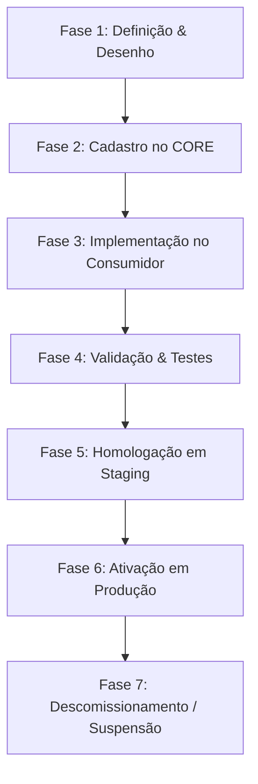
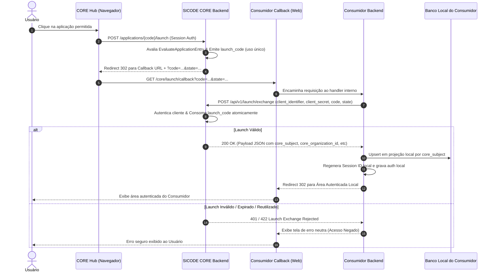

# Padrão Normativo de Integração de Aplicações no SICODE CORE (SICODE CORE Application Integration Standard)

Data: 21/07/2026  
Status: Normativo  
Versão do Documento: 1.0.0  

---

## 1. Objetivo e Escopo

Este documento estabelece o **Padrão Normativo de Integração de Aplicações no SICODE CORE** (`SICODE CORE Application Integration Standard`). Ele define os requisitos técnicos, arquiteturais, de segurança, de ciclo de vida e de conformidade que **toda aplicação consumidora DEVE seguir** para ser cadastrada, autorizada, lançada, autenticada e operada no SICODE Ecosystem.

O padrão é rigorosamente **independente de linguagem de programação, biblioteca ou framework web**. Ele se aplica igualmente a aplicações desenvolvidas em Laravel, Node.js, Spring Boot (Java), .NET, Python, Go ou qualquer tecnologia futura.

---

## 2. Problema Resolvido

No SICODE Ecosystem, o **SICODE CORE** é a autoridade canônica e soberana para gestão de identidades, organizações, contratos institucionais e permissão de entrada em aplicações (`ApplicationEntry`).

Sem um padrão normativo estrito, aplicações consumidoras poderiam:
1. Duplicar bases de usuários e criar identidades locais concorrentes;
2. Armazenar senhas locais ou hashes pertencentes ao CORE;
3. Acessar diretamente o banco de dados PostgreSQL do CORE;
4. Reinterpretar arbitrariamente regras de vigência temporal de contratos ou permissões;
5. Confiar em dados de identidade ou autorização passados pelo navegador via query string ou cookies não assinados;
6. Criar protocolos de autenticação ad-hoc incompatíveis entre si;
7. Acoplar a arquitetura de aplicações consumidoras à stack interna do CORE (Laravel 13/Livewire 4).

Este padrão elimina esses riscos ao estabelecer um contrato público, desacoplado e seguro entre o CORE e qualquer aplicação integrada.

---

## 3. Princípios Normativos

Todas as aplicações consumidoras e integrações no ecossistema DEVEM obedecer rigorosamente aos 17 princípios abaixo (conforme taxonomia RFC 2119):

1. **Autoridade Canônica Única**: O SICODE CORE é a autoridade soberana e exclusiva de identidade, autenticação e autorização de entrada.
2. **Proibição de Senhas Locais**: Aplicações consumidoras NÃO DEVEM solicitar nem armazenar senhas ou hashes de credenciais do CORE, salvo exceção arquitetural formalmente aprovada em ADR.
3. **Proibição de Acesso Direto ao Banco**: Aplicações consumidoras NÃO DEVEM realizar consultas SQL diretas, conexões de banco de dados ou compartilhamento de tabelas/migrations com o banco de dados do CORE.
4. **Autorização por Contratos Públicos**: Direitos de acesso e contextos DEVEM ser obtidos exclusivamente através dos serviços e protocolos públicos expostos pelo CORE.
5. **Projeção Local Mínima**: A aplicação consumidora DEVE manter apenas uma projeção local mínima de dados vinculada exclusivamente ao identificador canônico `core_subject`.
6. **Imutabilidade do Identificador Canônico**: O identificador canônico da identidade é o `core_subject` (UUID v4 opaco). O e-mail, CPF, CNPJ ou login local NÃO DEVEM ser usados como chave de vínculo primário nem como autoridade permanente de identidade.
7. **Independência de Atributos Mutáveis**: Atributos mutáveis (como e-mail, nome ou telefone) NÃO DEVEM ser utilizados como autoridade de autorização nem para alteração silenciosa de vínculo de identidade.
8. **Desconfiança Absoluta do Navegador**: O navegador do usuário NÃO É fonte confiável de identidade ou autorização. Nenhum parâmetro vindo da URL ou de formulários pode alterar identidades sem validação no backend.
9. **Opacidade e Uso Único do Launch Code**: O código de lançamento (`launch_code`) DEVE ser opaco para o cliente HTTP, de curto prazo e de consumo estritamente único e atômico.
10. **Troca Backend-to-Backend Obrigatória**: A resolução de um `launch_code` em payload de identidade DEVE ocorrer exclusivamente por comunicação direta e autenticada backend-to-backend entre a aplicação consumidora e o CORE.
11. **Independência de Sessão**: A sessão autenticada da aplicação consumidora é local, independente e isolada da sessão de navegador do CORE Hub.
12. **Validação Obrigatória de Contrato e Audience**: O consumidor DEVE validar obrigatoriamente a assinatura/emissor (`iss`), o código da aplicação (`application`), o contexto (`context`) e a integridade da resposta retornada no exchange.
13. **Segredo Fora de Logs e URLs**: Credenciais de cliente (`client_secret`) e códigos de lançamento NUNCA DEVEM aparecer em URLs, query strings, logs de aplicação, trilhas de auditoria pública ou código-fonte.
14. **Soberania dos Dados Operacionais**: Dados de negócio e dados operacionais específicos da aplicação continuam pertencendo exclusivamente à aplicação consumidora.
15. **Desconhecimento de Domínio pelo CORE**: O CORE NÃO DEVE possuir conhecimento das regras de negócio, tabelas operacionais ou detalhes de domínio interno das aplicações consumidoras.
16. **Segurança por Padrão (Fail-Closed)**: Qualquer falha na comunicação backend-to-backend, divergência de estado, expiração ou inconformidade de protocolo DEVE resultar na rejeição imediata da autenticação local (negação por padrão).
17. **Proibição de Protocolos Paralelos**: NENHUMA aplicação consumidora DEVE criar protocolos ad-hoc ou contornar o `Application Launch Protocol` para autorizar a entrada de usuários.

---

## 4. Classificação Formais de Aplicações

O SICODE Ecosystem reconhece três categorias formais de aplicações consumidoras:

### 4.1. Aplicação Web Interativa (`Interactive Web Application`)
Aplicações acessadas pelo usuário final através de navegador, cujos acessos são autorizados no CORE Hub e executados via `Application Launch Protocol`.
- **Exemplos**: SICODESK, SICODE ES, SICODE SP.
- **Protocolo de Integração**: `Application Launch Protocol` (Redirecionamento com `code` + `state` seguido de troca backend-to-backend).

### 4.2. Serviço Backend-to-Backend (`Backend-to-Backend Service`)
Serviços e APIs que consomem dados ou enviam eventos diretamente ao CORE sem intervenção direta de interface web do usuário.
- **Estado no Protocolo Atual**: *Padrão Futuro / Não Implementado no Launch Protocol Atual*. O protocolo de launch atual atende exclusivamente a navegação de usuários. Serviços de fundo devem utilizar credenciais dedicadas de API quando disponibilizados no CORE.

### 4.3. Aplicação Legada (`Legacy Application`)
Aplicações existentes no ecossistema que operam com bancos de dados legados, modelos locais históricos e necessitam de uma camada anticorrupção para transição gradual.
- **Exemplo**: SICODE Legacy ES / SP.
- **Regras de Exceção**: Tolera-se a existência de tabelas históricas de usuários e login local temporário durante a fase de transição (coexistência), mas o vínculo para o CORE DEVE usar estritamente o `core_subject` e o `Application Launch Protocol`.

---

## 5. Ciclo de Vida de Incorporação de uma Aplicação

Para integrar uma nova aplicação ao SICODE CORE, o processo DEVE cumprir rigorosamente as 7 fases a seguir:



### Fase 1 — Definição e Desenho Arquitetural
- Definição do nome canônico da aplicação e do `application_code` (ex: `sicodesk`, `sicode-sp`).
- Mapeamento dos contextos operacionais necessários (`context_code`).
- Classificação dos dados manipulados e requisitos de disponibilidade.
- Identificação do proprietário técnico e equipe responsável.

### Fase 2 — Cadastro no CORE
- Registro do registro `applications` no CORE (`code`, `name`, `status`, `requires_organization`, `requires_contract`).
- Registro dos contextos `application_contexts` associados.
- Criação das credenciais de cliente em `application_clients` (`client_identifier`, `client_secret_hash`, `callback_url`).
- Concessão de contratos institucionais e permissões (`application_accesses` e `contract_application_grants`).
- Auditoria do cadastro no CORE.

### Fase 3 — Implementação no Consumidor
- Construção da Camada Anticorrupção (`CoreIntegration`).
- Endpoint de recepção de callback de launch (suportando query params `code` e `state`).
- Cliente HTTP backend-to-backend para o endpoint de exchange do CORE.
- Resolução e upsert da projeção local de identidade (`core_subject`) e organização (`core_organization_id`).
- Inicialização e regeneração da sessão local da aplicação consumidora.
- Sanitização de logs e tratamento neutro de erros.

### Fase 4 — Validação e Testes
- Execução da matriz de conformidade (testes unitários, de integração e E2E).
- Teste de consumo de launch válido e rejeição de launch expirado/reutilizado.
- Teste de validação de `state`, `client_identifier` e `client_secret`.
- Teste de rotação de secret e resiliência contra indisponibilidade do CORE.

### Fase 5 — Homologação
- Provisionamento dos secrets de cliente em ambiente de Staging.
- Validação do callback registrado e política de TLS.
- Verificação de observabilidade, logs sanitizados e alertas de segurança.

### Fase 6 — Produção
- Ativação formal da aplicação no CORE (`status = 'active'`).
- Disponibilização da aplicação no CORE Hub para usuários autorizados.
- Monitoramento de métricas de lançamentos e rotação periódica de secrets.

### Fase 7 — Suspensão ou Descomissionamento
- Suspensão imediata no CORE (`status = 'suspended'` ou `ApplicationAccess` revogado).
- O CORE passa a rejeitar novos lançamentos no Hub e trocas no endpoint de exchange.
- Preservação da auditoria centralizada no CORE e retenção de histórico na projeção local do consumidor.

---

## 6. Fluxo Detalhado do Application Launch Protocol

### 6.1. Diagrama do Fluxo (Ponta a Ponta)



### 6.2. Passo a Passo Normativo
1. **Autenticação no CORE**: O usuário possui sessão autenticada ativa no SICODE CORE.
2. **Navegação no Hub**: O usuário seleciona uma aplicação visível no CORE Hub.
3. **Solicitação de Lançamento**: O navegador envia uma requisição `POST /applications/{application_code}/launch` ao CORE.
4. **Avaliação de Entrada em Tempo Real**: O CORE executa `EvaluateApplicationEntry` validando status de usuário, organização, contrato ativo e permissão individual (`ApplicationAccess`).
5. **Emissão de Launch Code**: O CORE gera um `launch_code` opaco, de uso único, com expiração curta (ex: 60 segundos), associado ao cliente, contexto, `state` e callback URL registradas.
6. **Redirecionamento do Navegador**: O CORE responde com `302 Redirect` enviando o navegador para o callback registrado da aplicação consumidora contendo os parâmetros `code` e `state`.
7. **Recepção no Consumidor**: O endpoint de callback do consumidor recebe a requisição HTTP `GET`.
8. **Troca Backend-to-Backend**: O consumidor realiza uma chamada `POST` diretamente para o endpoint `/api/v1/launch/exchange` do CORE enviando em JSON:
   - `client_identifier`
   - `client_secret`
   - `code`
   - `state`
9. **Autenticação do Consumidor e Consumo Atômico**: O CORE valida as credenciais do cliente, verifica se o código não expirou nem foi consumido previamente e o invalida atomicamente no banco de dados.
10. **Retorno do Payload de Identidade**: O CORE responde `200 OK` com o JSON contendo os identificadores canônicos e contextos autorizados.
11. **Sincronização da Projeção Local**: O consumidor localiza ou cria o registro local vinculado estritamente ao `core_subject` (e `core_organization_id` quando exigido).
12. **Estabelecimento de Sessão Local**: O consumidor invalida qualquer sessão anterior, regenera o ID de sessão local e armazena a referência local autenticada.
13. **Redirecionamento Seguro**: O consumidor redireciona o usuário para a rota interna autorizada.

### 6.3. Tratamento de Cenários de Falha

| Cenário de Falha | Comportamento do CORE | Comportamento do Consumidor |
| :--- | :--- | :--- |
| `launch_code` inexistente | Rejeita troca com HTTP 422 | Exibe erro neutro ("Falha na autenticação"), não cria sessão |
| `launch_code` expirado | Rejeita troca com HTTP 422 | Exibe erro neutro ("Sessão expirada"), solicita novo lançamento |
| `launch_code` já utilizado (Replay) | Rejeita troca com HTTP 422 | Detecta tentativa de replay, loga alerta de segurança, não altera sessão |
| `client_identifier` ou `client_secret` inválidos | Rejeita autenticação com HTTP 401 | Rejeita entrada, gera alerta crítico de configuração de credenciais |
| `state` divergente do emitido | Rejeita troca com HTTP 422 | Rejeita entrada, registra log de potencial violação de integridade |
| Callback URL não autorizada | Rejeita emissão do lançamento no Hub | O navegador não chega a ser redirecionado para o consumidor |
| Usuário ou Contrato suspenso/expirado | Nega lançamento na avaliação `EvaluateApplicationEntry` | Hub exibe mensagem "Entrada indisponível para esta aplicação" |
| Indisponibilidade na troca backend-to-backend | Timeout de conexão HTTP no consumidor | Consumidor falha de forma segura (fail-closed), não autentica o usuário |

---

## 7. Contrato de Dados (Payload de Exchange)

O contrato de dados retornado no endpoint `/api/v1/launch/exchange` do CORE é estritamente imutável e estruturado no seguinte payload JSON:

```json
{
  "iss": "https://sicode.sistemas.gov.br",
  "core_subject": "9b1deb4d-3b7d-4bad-9bdd-2b0d7b3dcb6d",
  "core_organization_id": "8f2a1b3c-4d5e-6f7a-8b9c-0d1e2f3a4b5c",
  "application": "sicodesk",
  "context": "sp",
  "launch_id": "123e4567-e89b-12d3-a456-426614174000",
  "issued_at": "2026-07-21T18:00:00.000000Z",
  "expires_at": "2026-07-21T18:01:00.000000Z",
  "state": "b7d8e9f0a1b2c3d4e5f6"
}
```

### 7.1. Especificação Detalhada dos Campos

| Campo | Tipo | Obrigatoriedade | Categoria | Descrição e Finalidade | Persistência Permitida no Consumidor |
| :--- | :--- | :--- | :--- | :--- | :--- |
| `iss` | `string` | **Obrigatório** | Identificador | Emissor soberano do token/payload (`issuer`). Usado para validar a autoridade. | Sim (nas configurações de integração) |
| `core_subject` | `string (UUID)` | **Obrigatório** | Identificador Canônico | Chave primária imutável e soberana do usuário no CORE. | **SIM (Obrigatório como chave de vínculo local)** |
| `core_organization_id` | `string (UUID)` | Opcional / Condicional | Identificador Canônico | Chave primária da organização ativa autorizada no CORE. Obrigatorio se a aplicação exigir organização. | **SIM (Obrigatório para vínculo de empresa/órgão)** |
| `application` | `string` | **Obrigatório** | Autorização | Código da aplicação autorizada (DEVE ser igual ao `application_code` local). | Sim (em logs neutros e validação) |
| `context` | `string` | Opcional | Autorização | Código do contexto operacional autorizado (ex: `sp`, `es`). | Sim (em logs neutros e sessão local) |
| `launch_id` | `string (UUID)` | **Obrigatório** | Correlação Técnica | Identificador único da transação de lançamento para rastreabilidade auditável. | Sim (apenas em logs de auditoria local) |
| `issued_at` | `string (ISO8601)` | **Obrigatório** | Timestamp | Data e hora exata em que o launch foi emitido pelo CORE. | Sim (para auditoria) |
| `expires_at` | `string (ISO8601)` | **Obrigatório** | Timestamp | Data e hora limite de validade do launch. | Não (código expira na troca) |
| `state` | `string` | **Obrigatório** | Correlação Técnica | String de correlação opaca enviada no lançamento para proteção contra CSRF/Replay. | Não (usado apenas durante a validação da troca) |

---

## 8. Versionamento do Contrato de Integração

1. **Retrocompatibilidade Garantida**: A adição de novos campos opcionais ao payload JSON de exchange é considerada mudança não-quebrante. Aplicações consumidoras DEVEM ser desenvolvidas para ignorar campos desconhecidos no JSON.
2. **Mudanças Quebrantes**: Alterações no nome de campos existentes, remoção de campos ou modificação do significado semântico exigirão nova versão de API (ex: `/api/v2/launch/exchange`).
3. **Registro de Dívida Arquitetural**: *O contrato atual de exchange não expõe um header ou campo explícito de versão semântica de schema (v1)*. Registra-se esta lacuna como oportunidade de evolução futura para inclusão de `version: "1.0"` no payload.

---

## 9. Projeção Local de Identidade e Organização

A aplicação consumidora DEVE manter uma tabela local de projeção para associar a identidade canônica do CORE ao seu modelo operacional interno.

### 9.1. Invariantes de Projeção Local
- O vínculo entre `core_subject` e o usuário local DEVE ser de cardinalidade de no máximo 1:1 por runtime.
- O vínculo entre `core_organization_id` e a empresa/órgão local DEVE ser de no máximo 1:1 por runtime.
- Um e-mail divergente recebido futuramente NÃO DEVE alterar o `core_subject` vinculado nem sobrescrever a conta local de outro usuário.

### 9.2. Schema Conceitual Mínimo de Projeção (`core_identity_links`)

```text
Table: core_identity_links
--------------------------------------------------------------------------------
local_id             : Primary Key (UUID ou Auto-Increment local)
core_issuer          : String (ex: "https://sicode.sistemas.gov.br")
core_subject         : UUID (NOT NULL, UNIQUE INDEX)
local_user_id        : Foreign Key para a tabela local de usuários (NOT NULL, UNIQUE)
status               : Enum ('active', 'revoked', 'suspended')
first_seen_at        : Timestamp (NOT NULL)
last_seen_at         : Timestamp (NOT NULL)
created_at           : Timestamp
updated_at           : Timestamp
--------------------------------------------------------------------------------
```

---

## 10. Contexto Organizacional e Autorização

1. **Separação entre Identidade e Organização**: Autenticar um `core_subject` não concede autorização automática para todas as organizações cadastradas na aplicação consumidora.
2. **Soberania do Contexto Emitido**: A aplicação consumidora DEVE utilizar estritamente o `core_organization_id` retornado pelo CORE na troca.
3. **Proibição de Seleção Arbitrária**: A aplicação consumidora NÃO DEVE permitir que o usuário altere a organização ativa na sessão local sem passar por um novo lançamento autorizado no CORE Hub.

---

## 11. Gestão de Sessão na Aplicação Consumidora

A aplicação consumidora é integralmente responsável por gerenciar sua própria sessão HTTP local:

1. **Regeneração de Session ID**: A aplicação consumidora DEVE obrigatoriamente regenerar o ID da sessão HTTP imediatamente após validar a troca do launch (proteção contra Session Fixation).
2. **Isolamento de Cookies**: Os cookies de sessão da aplicação consumidora DEVEM ser totalmente independentes dos cookies do CORE.
3. **Atributos de Segurança dos Cookies**:
   - `HttpOnly`: **Obrigatório** (impede acesso via JavaScript/XSS).
   - `Secure`: **Obrigatório** em ambientes de staging e produção (exige HTTPS).
   - `SameSite`: `Lax` ou `Strict`.
4. **Encerramento de Sessão (Logout)**:
   - O logout na aplicação consumidora encerra a sessão local e limpa os cookies locais.
   - A aplicação consumidora DEVE oferecer botão de saída que invalide a sessão local e redirecione o usuário de volta para o CORE Hub ou login centralizado.

---

## 12. Segurança, Proteção e Criptografia

1. **TLS Obrigatório**: Todas as chamadas de callback e trocas backend-to-backend DEVEM ser trafegadas obrigatoriamente sobre HTTPS/TLS 1.2+ em homologação e produção.
2. **Segredo de Cliente (`client_secret`)**:
   - O `client_secret` DEVE possuir alta entropia (mínimo 64 caracteres randômicos).
   - O `client_secret` DEVE ser armazenado de forma segura no consumidor (variáveis de ambiente do servidor) e nunca commitado em repositórios de código.
   - O CORE armazena apenas o hash seguro do `client_secret` (`client_secret_hash`).
3. **Proteção contra CSRF e Replay**:
   - O `launch_code` é de uso estritamente único. O CORE invalida o código no banco durante a transação de troca.
   - Tentativas de reutilizar o mesmo `launch_code` resultarão em rejeição com erro `422 Unprocessable Entity`.
4. **Allowlist de Callback URLs**: O CORE valida rigorosamente se a URL de callback que recebe o código é exatamente uma das URLs autorizadas para aquele `client_identifier`.

---

## 13. Configuração Padronizada por Ambiente

A aplicação consumidora DEVE declarar suas configurações de integração através de variáveis de ambiente no padrão conceitual a seguir:

| Variável Conceitual | Exemplo de Valor | Descrição / Sensibilidade |
| :--- | :--- | :--- |
| `CORE_BASE_URL` | `https://sicode.sistemas.gov.br` | URL base do servidor CORE (Pública) |
| `CORE_APPLICATION_CODE` | `sicodesk` | Código da aplicação cadastrada no CORE (Pública) |
| `CORE_CLIENT_IDENTIFIER` | `sicodesk-sp-client-01` | Identificador do cliente cadastrado (Pública) |
| `CORE_CLIENT_SECRET` | `sec_live_9f8e7d6c5b4a...` | Segredo do cliente para troca backend (CRÍTICO / SENSÍVEL) |
| `CORE_LAUNCH_CALLBACK_URL` | `https://sicodesk.gov.br/core/launch/callback` | Callback registrada para esta aplicação (Pública) |
| `CORE_EXCHANGE_TIMEOUT` | `5.0` | Timeout em segundos para a chamada HTTP (Operacional) |
| `CORE_VERIFY_TLS` | `true` | Exigência de validação de certificado TLS (Segurança) |

---

## 14. Observabilidade e Logs Seguros

### 14.1. Logs Permitidos
- Registrar o início e conclusão do exchange contendo: `application_code`, `launch_id`, `core_subject` (hash/UUID neutro), `duration_ms` e `status_code` HTTP.
- Registrar erros técnicos com códigos neutros e `correlation_id`.

### 14.2. Logs PROIBIDOS (Expressamente Vedados)
- NUNCA registrar o `client_secret` em arquivos de log.
- NUNCA registrar o `launch_code` em logs de aplicação ou servidores web.
- NUNCA registrar tokens de sessão ou payloads contendo senhas/hashes.

---

## 15. Matriz Normativa de Tratamento de Erros

A aplicação consumidora DEVE tratar todas as exceções de integração de acordo com a tabela normativa abaixo:

| Condição de Erro | Resposta do CORE / Sistema | Mensagem Pública Exibida ao Usuário | Ação do Consumidor & Log Interno | Policy Retry |
| :--- | :--- | :--- | :--- | :--- |
| **Timeout de Conexão com CORE** | N/A (Falha de Rede) | "Serviço de autenticação temporariamente indisponível." | Loga `ERROR: Core Exchange Timeout`. Nega acesso. | **PROIBIDO** |
| **Erro de Certificado TLS** | N/A (Falha de Rede) | "Erro de conexão de segurança." | Loga `CRITICAL: Core TLS Validation Failure`. | **PROIBIDO** |
| **401 Client Auth Failed** | `{"message": "Launch exchange rejected."}` | "Falha de configuração do sistema." | Loga `CRITICAL: Client Secret Mismatch`. Revisa env vars. | **PROIBIDO** |
| **422 Launch Invalid / Expired** | `{"message": "Launch exchange rejected."}` | "Link de acesso inválido ou expirado." | Loga `WARNING: Launch Code Expired or Replayed`. | **PROIBIDO** |
| **Divergência de State** | N/A (Validação Local) | "Falha de validação de segurança." | Loga `SECURITY: State Mismatch Detected`. | **PROIBIDO** |
| **Organização Não Vinculada** | N/A (Validação Local) | "Organização não cadastrada no sistema local." | Loga `WARNING: Organization Link Required`. | **PROIBIDO** |
| **Falha no Banco Local** | N/A (Erro do Consumidor) | "Erro interno no sistema local." | Loga `ERROR: Database Upsert Failed`. Executa Rollback. | **PROIBIDO** |

---

## 16. Matriz de Testes de Conformidade

Toda aplicação consumidora DEVE implementar e executar a suíte de testes de conformidade contendo:

1. **Testes de Contrato (Contract Tests)**:
   - Validação de envio dos parâmetros obrigatórios no payload JSON de exchange.
   - Deserialização correta do JSON de resposta (`ApplicationLaunchExchangeResult`).
2. **Testes de Segurança (Security Tests)**:
   - Validação de falha quando `launch_code` é reutilizado (Replay).
   - Validação de rejeição quando `state` enviado é divergente.
   - Verificação de não inclusão de `client_secret` em logs de teste.
3. **Testes de Projeção Local**:
   - Validação de criação idempotente do vínculo por `core_subject`.
   - Garantia de que execuções repetidas com o mesmo `core_subject` atualizam `last_seen_at` sem duplicar registros.
4. **Testes de Resiliência**:
   - Simulação de timeout HTTP na troca backend-to-backend e verificação do comportamento *fail-closed*.

---

## 17. Matriz de Responsabilidades (RACI)

```text
+---------------------------------------------------+------+-----------+-------+--------+
| Atividade / Responsabilidade                      | CORE | Consumidor| Infra | Gestão |
+---------------------------------------------------+------+-----------+-------+--------+
| Autenticação soberana do usuário                  |  R   |     I     |   I   |   I    |
| Avaliação de contratos e direitos (ApplicationEntry)| R  |     I     |   I   |   A    |
| Emissão do launch_code opaco                      |  R   |     I     |   I   |   I    |
| Validação atômica e troca backend-to-backend      |  R   |     R     |   C   |   I    |
| Manutenção da projeção local (core_identity_links)|  I   |     R     |   I   |   I    |
| Criação e regeneração da sessão local             |  I   |     R     |   I   |   I    |
| Regras de negócio e dados operacionais internos  |  I   |     R     |   I   |   A    |
| Gestão de variáveis de ambiente e TLS             |  I   |     C     |   R   |   I    |
| Aprovação de perfil de acesso e onboarding        |  I   |     I     |   I   |   R    |
+---------------------------------------------------+------+-----------+-------+--------+
Legenda: R = Responsável (Executa); A = Autoridade (Aprova); C = Consultado; I = Informado.
```

---

## 18. Exemplo Tecnológico Neutro (Pseudocódigo)

O algoritmo neutro a seguir ilustra a sequência exata de processamento no callback de uma aplicação consumidora:

```text
FUNCTION handleCoreLaunchCallback(request):
    // 1. Sanitização dos parâmetros básicos de entrada
    code = sanitizeString(request.queryParams.get("code"))
    state = sanitizeString(request.queryParams.get("state"))
    
    IF code IS EMPTY OR state IS EMPTY THEN:
        LOG_WARNING("Callback de launch recebido sem parâmetros obrigatórios")
        RETURN renderErrorView("Parâmetros de acesso inválidos", statusCode=400)
    END IF

    // 2. Montagem do payload de troca backend-to-backend
    exchangePayload = {
        "client_identifier": CONFIG.get("CORE_CLIENT_IDENTIFIER"),
        "client_secret": CONFIG.get("CORE_CLIENT_SECRET"),
        "code": code,
        "state": state
    }

    // 3. Execução da chamada HTTP síncrona backend-to-backend para o CORE
    TRY:
        httpResponse = httpClient.post(
            url = CONFIG.get("CORE_BASE_URL") + "/api/v1/launch/exchange",
            json = exchangePayload,
            timeoutSeconds = CONFIG.get("CORE_EXCHANGE_TIMEOUT"),
            verifyTLS = CONFIG.get("CORE_VERIFY_TLS")
        )
    CATCH TimeoutException:
        LOG_ERROR("Timeout na chamada backend-to-backend de exchange com o CORE")
        RETURN renderErrorView("Serviço de autenticação indisponível", statusCode=503)
    CATCH NetworkException AS e:
        LOG_ERROR("Falha de rede ao conectar no CORE: " + e.message)
        RETURN renderErrorView("Erro de conexão de autenticação", statusCode=502)
    END TRY

    // 4. Validação da resposta do CORE
    IF httpResponse.statusCode != 200 THEN:
        LOG_SECURITY_ALERT("Troca de launch rejeitada pelo CORE", statusCode = httpResponse.statusCode)
        RETURN renderErrorView("Acesso não autorizado pelo CORE", statusCode=401)
    END IF

    responseData = parseJSON(httpResponse.body)

    // 5. Validação dos atributos de segurança do payload recebido
    IF responseData.get("iss") != CONFIG.get("CORE_BASE_URL") THEN:
        LOG_SECURITY_ALERT("Issuer retornado inválido: " + responseData.get("iss"))
        RETURN renderErrorView("Falha de validação do emissor", statusCode=401)
    END IF

    IF responseData.get("application") != CONFIG.get("CORE_APPLICATION_CODE") THEN:
        LOG_SECURITY_ALERT("Aplicação no payload diverge da aplicação local")
        RETURN renderErrorView("Aplicação incorreta no token", statusCode=401)
    END IF

    coreSubject = responseData.get("core_subject")
    coreOrganizationId = responseData.get("core_organization_id")

    // 6. Transação local de upsert da projeção de identidade
    BEGIN_LOCAL_TRANSACTION()
    TRY:
        localUser = findOrCreateLocalProjection(
            coreSubject = coreSubject,
            coreOrganizationId = coreOrganizationId
        )
        
        updateLastSeenTimestamp(localUser.id, currentTimeStamp())
        
        COMMIT_LOCAL_TRANSACTION()
    CATCH DatabaseException AS dbErr:
        ROLLBACK_LOCAL_TRANSACTION()
        LOG_ERROR("Falha ao salvar projeção local de identidade: " + dbErr.message)
        RETURN renderErrorView("Erro interno ao processar login local", statusCode=500)
    END TRY

    // 7. Regeneração e gravação da Sessão Local
    session.invalidateAndRegenerateId()
    session.set("authenticated_user_id", localUser.id)
    session.set("core_subject", coreSubject)
    session.set("core_organization_id", coreOrganizationId)
    session.set("authenticated_at", currentTimeStamp())

    // 8. Redirecionamento para a Área Autenticada Local
    RETURN redirectToLocalUrl("/dashboard")
END FUNCTION
```

---

## 19. Documentos Relacionados
- [ADR-001: Autoridade de Identidade CORE](file:///home/will/code/ecosystem/docs/decisions/ADR-001-core-identity-authority-and-legacy-transition.md)
- [ADR-002: Protocolo de Lançamento CORE](file:///home/will/code/ecosystem/docs/decisions/ADR-002-core-launch-protocol-and-legacy-consumer.md)
- [ADR-004: Padrão de Integração de Aplicações](file:///home/will/code/ecosystem/docs/decisions/ADR-004-core-application-integration-standard.md)
- [Checklist de Conformidade de Integração](file:///home/will/code/ecosystem/docs/checklists/core-application-integration-checklist.md)
- [Runbook de Rotação de Secret de Cliente](file:///home/will/code/ecosystem/docs/runbooks/core-application-client-secret-rotation.md)
- [Guia de Testes de Contrato](file:///home/will/code/ecosystem/docs/testing/core-application-contract-testing.md)
