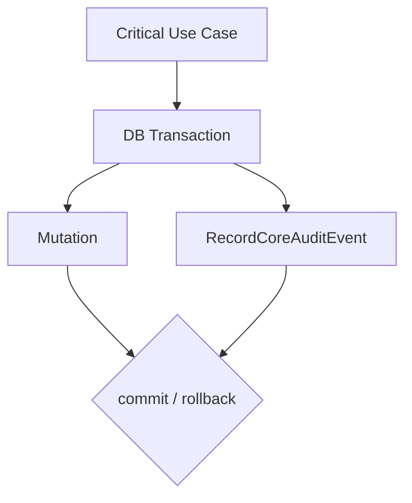

# Fundacao de auditoria do CORE

Este documento define a fundacao minima de auditoria do SICODE CORE para mutacoes criticas de identidade, autoridade e direito global de entrada.

## Objetivo

Registrar eventos duraveis, estruturados, explicaveis e seguros sobre alteracoes criticas do CORE.

A auditoria responde quem originou a acao, qual acao ocorreu, qual entidade CORE foi afetada, quando ocorreu, qual Application/Context estava envolvido quando aplicavel, qual motivo foi informado e qual operacao logica correlaciona eventos relacionados.

## Fronteira

A auditoria CORE inclui somente eventos ligados a identidade canonica, identidade externa, estado global do usuario, vinculo organizacional, contrato institucional, catalogo de Application/ApplicationClient/ApplicationContext, direito individual de entrada e grant institucional.

A auditoria CORE nao e log de debug, log HTTP generico, log de excecao, monitoramento de performance, historico completo de colunas, fila, event store, SIEM ou auditoria operacional de SICODE Legacy, SICODESK ou SICODE 2.0.

Eventos como `VIABILITY_APPROVED`, `PRODUCTION_DISPATCHED`, `TICKET_ASSIGNED` e `SLA_BREACHED` pertencem as aplicacoes proprietarias do dominio operacional.

## Modelo persistente

Tabela: `core_audit_events`.

Model: `App\Models\CoreAuditEvent`.

A tabela usa UUID PostgreSQL gerado por `gen_random_uuid()` e o Model estende `App\Models\CoreModel`, mantendo a autoridade de geracao do identificador no PostgreSQL.

Colunas principais: `id`, `occurred_at`, `actor_type`, `actor_id`, `action`, `subject_type`, `subject_id`, `application_id`, `context_id`, `reason`, `correlation_id`, `details`.

Nao ha `model_type`, `model_id`, `event`, `old_values`, `new_values` ou namespace PHP persistido.

## Actor

`actor_type` e um catalogo fechado:

- `USER`;
- `APPLICATION_CLIENT`;
- `SYSTEM`;
- `LEGACY_BRIDGE`.

`SYSTEM` exige `actor_id NULL`. Tipos identificaveis exigem `actor_id` UUID.

Nesta fundacao, `actor_id` nao possui FK polimorfica; a integridade estrutural fica em tipo fechado + UUID, e a origem semantica e definida pelo tipo. Nao ha dependencia de `auth()->user()` ou Auth facade.

## Subject

`subject_type` e um catalogo fechado de entidades CORE diretamente afetadas:

- `USER`;
- `LOCAL_PASSWORD_CREDENTIAL`;
- `LOCAL_AUTHENTICATION_ATTEMPT`;
- `EXTERNAL_IDENTITY`;
- `ORGANIZATION`;
- `ORGANIZATION_MEMBERSHIP`;
- `CONTRACT`;
- `APPLICATION`;
- `APPLICATION_CLIENT`;
- `APPLICATION_CONTEXT`;
- `APPLICATION_ACCESS`;
- `CONTRACT_APPLICATION_GRANT`.

`subject_id` e UUID canonico. O storage nao depende de classes PHP.

## Actions

`action` e um catalogo fechado implementado em `App\CoreAudit\CoreAuditAction` e protegido por CHECK constraint.

Catalogo inicial:

- `USER_BLOCKED`;
- `USER_UNBLOCKED`;
- `USER_DEACTIVATED`;
- `USER_CANONICAL_NAME_CHANGED`;
- `USER_CANONICAL_EMAIL_CHANGED`;
- `LOCAL_PASSWORD_CREDENTIAL_CREATED`;
- `LOCAL_PASSWORD_CREDENTIAL_CHANGED`;
- `LOCAL_PASSWORD_CREDENTIAL_DISABLED`;
- `LOCAL_PASSWORD_CREDENTIAL_REHASHED`;
- `LOCAL_AUTHENTICATION_SUCCEEDED`;
- `LOCAL_AUTHENTICATION_REJECTED`;
- `LOCAL_SESSION_ENDED`;
- `EXTERNAL_IDENTITY_LINKED`;
- `EXTERNAL_IDENTITY_REVOKED`;
- `EXTERNAL_IDENTITY_ARCHIVED`;
- `EXTERNAL_IDENTITY_RECONCILED`;
- `ORGANIZATION_MEMBERSHIP_CREATED`;
- `ORGANIZATION_MEMBERSHIP_ACTIVATED`;
- `ORGANIZATION_MEMBERSHIP_SUSPENDED`;
- `ORGANIZATION_MEMBERSHIP_REACTIVATED`;
- `ORGANIZATION_MEMBERSHIP_ENDED`;
- `CONTRACT_CREATED`;
- `CONTRACT_ACTIVATED`;
- `CONTRACT_SUSPENDED`;
- `CONTRACT_REACTIVATED`;
- `CONTRACT_ENDED`;
- `APPLICATION_CREATED`;
- `APPLICATION_DEACTIVATED`;
- `APPLICATION_CLIENT_CREATED`;
- `APPLICATION_CLIENT_DEACTIVATED`;
- `APPLICATION_CONTEXT_CREATED`;
- `APPLICATION_CONTEXT_DEACTIVATED`;
- `APPLICATION_ENTRY_REQUIREMENTS_CHANGED`;
- `APPLICATION_ACCESS_GRANTED`;
- `APPLICATION_ACCESS_REVOKED`;
- `APPLICATION_ACCESS_SUSPENDED`;
- `APPLICATION_ACCESS_REACTIVATED`;
- `CONTRACT_APPLICATION_GRANT_GRANTED`;
- `CONTRACT_APPLICATION_GRANT_REVOKED`;
- `CONTRACT_APPLICATION_GRANT_SUSPENDED`;
- `CONTRACT_APPLICATION_GRANT_REACTIVATED`.

## Reason

`reason` e opcional no schema e limitado a 500 bytes.

A obrigatoriedade de motivo para acoes como bloqueio, suspensao, revogacao, reconciliacao e alteracao manual de vinculo critico pertence ao caso de uso transacional futuro que executara a mutacao. A tabela nao tenta codificar todas essas regras por CHECK porque a obrigatoriedade pode depender do fluxo e do ator.

`reason` nao deve armazenar stack trace, exception message ou dump tecnico.

## Details

`details` e JSONB opcional para dados estruturados necessarios a explicabilidade do evento.

Contrato:

- raiz deve ser objeto JSON;
- limite aplicado pelo recorder: 8192 bytes codificados;
- produzido explicitamente pelo caso de uso;
- nunca payload bruto de request;
- nunca Model serializado.

Exemplo legitimo:

```json
{
  "from_normalized": "old@example.test",
  "to_normalized": "new@example.test"
}
```

Chaves sensiveis sao rejeitadas pelo recorder quando equivalem ou contem `password`, `token`, `secret`, `authorization`, `cookie` ou `client_secret`.

Dados como senhas, tokens, cookies, Authorization header, links de convite, chaves criptograficas, documentos pessoais completos e dumps de request sao proibidos.

## Correlation ID

`correlation_id` e UUID opcional.

O chamador fornece o mesmo identificador quando multiplos eventos pertencem a uma unica operacao logica. A fundacao nao implementa middleware HTTP de correlation ID e nao gera IDs diferentes automaticamente por evento.

## Application e Context

`application_id` e `context_id` sao nullable.

Eventos globais como `USER_BLOCKED` podem nao ter Application/Context. Eventos de access/grant e alteracoes de requirements devem informar Application e, quando a operacao for escopada, Context.

O recorder nao deriva contexto por consulta magica. O chamador futuro deve fornecer a relacao conhecida da operacao.

O banco protege FK para `applications`, FK para `application_contexts`, `context_id` exige `application_id`, e trigger `core_audit_events_context_application_check` reutiliza `core_assert_context_matches_application()` para garantir que o contexto pertence a mesma aplicacao.

## Append-only

Eventos sao append-only pela aplicacao e tambem possuem protecao de banco contra `UPDATE` e `DELETE` por triggers:

- `core_audit_events_prevent_update`;
- `core_audit_events_prevent_delete`.

Essa protecao nao pretende impedir um administrador PostgreSQL privilegiado de alterar o banco diretamente. Ela impede mutacao normal por aplicacao ou conexao sem intervencao administrativa.

O Model nao usa SoftDeletes, nao expoe restore e nao oferece CRUD.

## Recorder

Capability: `App\CoreAudit\RecordCoreAuditEvent`.

Entrada: DTO imutavel `App\CoreAudit\CoreAuditRecord`.

Responsabilidades:

- validar actor SYSTEM versus identificaveis;
- validar limite de `reason`;
- validar raiz/serializacao/tamanho de `details`;
- rejeitar chaves sensiveis conhecidas em `details`;
- inserir um evento em `core_audit_events`.

O recorder nao inicia transacao propria e nao usa queue.

## Comportamento transacional

Mutacoes criticas futuras devem gravar o evento de auditoria na mesma transacao da alteracao de estado.



Se a transacao fizer commit, mutacao e evento persistem juntos.

Se a transacao fizer rollback, mutacao e evento sao revertidos juntos.

Mutacao critica sem auditoria obrigatoria significa operacao nao concluida.

## Relacao com logging

Auditoria e logging tecnico sao sistemas distintos.

O recorder nao usa logger como storage, nao envia `details` para logs e nao implementa fallback silencioso. Falha ao gravar auditoria deve falhar a operacao transacional futura.

## Relacao com ApplicationEntry

`EvaluateApplicationEntry` permanece read-only e side-effect free.

Avaliacoes de entrada nao geram auditoria automaticamente.

`ApplicationEntryReason` nao e `CoreAuditAction`. Reasons explicam uma decisao read-only; actions registram mutacoes criticas.
