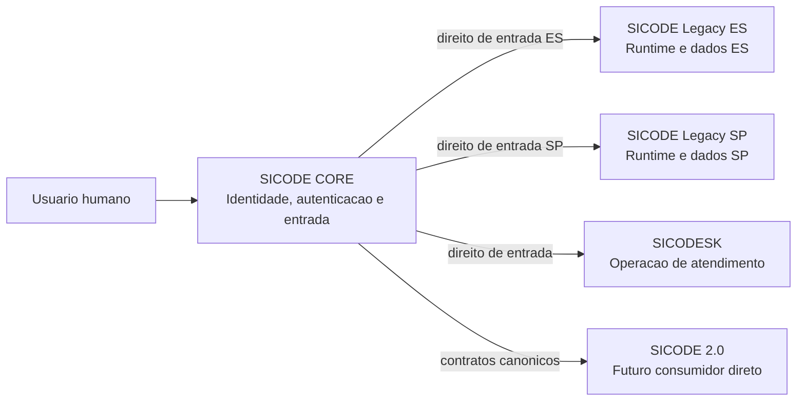
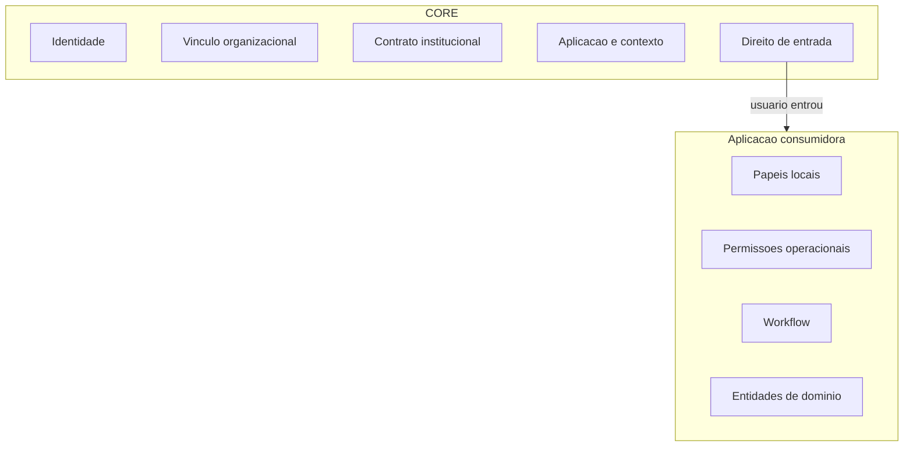
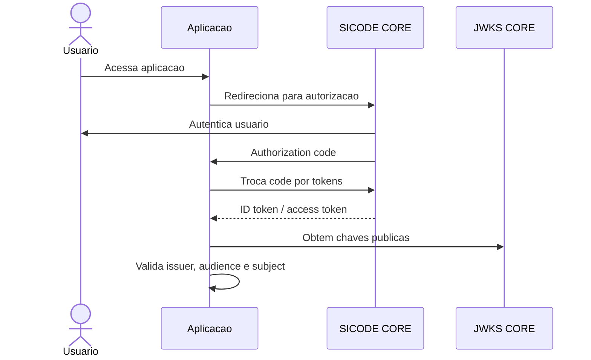

# Canon arquitetural de identidade e acesso do SICODE CORE

Este documento e normativo para desenvolvimento humano, agentes de IA e revisoes arquiteturais do SICODE Ecosystem.

Palavras normativas:

- OBRIGATORIO: a regra deve ser respeitada.
- PROIBIDO: a solucao nao pode ser utilizada.
- RECOMENDADO: e o padrao esperado, salvo justificativa documentada.
- PERMITIDO: e uma variacao aceita.
- EXCECAO: exige decisao arquitetural registrada.

## Principio fundador

OBRIGATORIO: o SICODE CORE e a autoridade canonica de identidade e acesso ao ecossistema.

OBRIGATORIO: toda identidade humana global deve possuir identificador canonico estavel no CORE.

RECOMENDADO: o identificador canonico de usuario deve ser UUID.

PROIBIDO: utilizar IDs locais do Legacy, SICODESK ou qualquer aplicacao como identidade global.

PROIBIDO: aplicacoes acessarem diretamente tabelas, migrations, Models, classes PHP ou banco do CORE.

OBRIGATORIO: aplicacoes consumidoras devem integrar com o CORE por protocolo e contratos externos documentados.

## Contexto do ecossistema



## Fronteira de responsabilidade

CORE e responsavel por:

- identidade global;
- autenticacao;
- estado da identidade;
- vinculo organizacional;
- contratos institucionais;
- catalogo de aplicacoes;
- clientes de autenticacao;
- contextos operacionais autorizados;
- direito de entrada na aplicacao.

Aplicacoes sao responsaveis por:

- funcoes internas;
- papeis locais;
- permissoes operacionais;
- regras de dominio;
- estados de workflow;
- autorizacao sobre entidades especificas.



Regra pratica: se a aplicacao desaparecer, a autorizacao ainda possui significado no ecossistema?

- Se sim, a regra pode pertencer ao CORE.
- Se nao, a regra pertence a aplicacao.

Exemplo:

- `access SICODE SP`: pertence ao CORE.
- `viability.approve`: pertence ao SICODE.
- `sicodesk.ticket.close`: pertence ao SICODESK.

EXCECAO: permissoes que parecam atravessar dominios exigem ADR antes de implementacao.

## Autorizacao efetiva de entrada

A decisao de entrada em aplicacao deve avaliar, quando aplicavel:

```text
USER_ACTIVE
AND MEMBERSHIP_ACTIVE
AND CONTRACT_ACTIVE
AND APPLICATION_ALLOWED_BY_CONTRACT
AND USER_APPLICATION_ACCESS_ACTIVE
AND APPLICATION_CLIENT_ALLOWED
AND CONTEXT_ALLOWED
```

PERMITIDO: usuarios internos ou aplicacoes administrativas podem nao exigir contrato, desde que a politica esteja registrada na configuracao canonica da aplicacao.

PROIBIDO: presumir que organizacao autorizada equivale a usuario autorizado.

PROIBIDO: presumir que usuario autorizado equivale a organizacao autorizada.

## Autenticacao e protocolo

OBRIGATORIO: o desenho do CORE deve ser compativel com OAuth 2.0 e OpenID Connect.

RECOMENDADO como protocolo final:

- Authorization Code Flow;
- PKCE para clientes publicos;
- tokens assinados;
- `issuer` estavel do CORE;
- `subject` estavel baseado na identidade canonica;
- validacao de `audience`;
- publicacao de chaves via JWKS;
- rotacao de chaves.

Capability minima inicial PERMITIDA:

- emissao de identidade canonica verificavel por contrato documentado;
- resolucao de usuario externo para usuario CORE;
- autorizacao de entrada por aplicacao, cliente e contexto;
- ponte controlada com Legacy.

PROIBIDO: criar autenticacao temporaria que contradiga OAuth 2.0/OIDC ou use IDs locais como `subject` global.



## SICODESK

OBRIGATORIO: o SICODESK deve utilizar identidade humana canonica do CORE.

OBRIGATORIO: o CORE decide se o usuario pode acessar o SICODESK.

OBRIGATORIO: papeis como operador, gestor, administrador, equipes, SLA, base de conhecimento e permissoes internas permanecem no SICODESK.

PROIBIDO: o SICODESK criar identidade humana paralela independente para usuarios do ecossistema.

PERMITIDO: o SICODESK manter projecao local minima do usuario para performance, auditoria e operacao.

## SICODE 2.0

OBRIGATORIO: o SICODE 2.0 deve consumir contratos canonicos do CORE diretamente.

PROIBIDO: o SICODE 2.0 depender de tabelas, nomes ou estruturas internas do Legacy.

OBRIGATORIO: ES e SP devem ser tratados como contextos operacionais segregados.

## Padroes obrigatorios

OBRIGATORIO: registrar identidades externas com provider, contexto, identificador externo, usuario CORE, estado e rastreabilidade.

OBRIGATORIO: preservar IDs historicos do Legacy.

OBRIGATORIO: manter a camada Legacy removivel.

OBRIGATORIO: registrar ADR para qualquer mudanca fundadora de identidade, autenticacao, autorizacao ou integracao entre CORE e aplicacoes.

## Padroes proibidos

PROIBIDO: usar `legacy.users.id` como identidade global.

PROIBIDO: criar `users.company_id` no CORE como vinculo organizacional canonico permanente.

PROIBIDO: criar tabelas globais com nomes acoplados ao Legacy quando o conceito for canonico, como `legacy_users` ou `legacy_companies`.

PROIBIDO: criar sincronizacao bidirecional de identidade sem ADR.

PROIBIDO: duplicar autoridade sobre o mesmo atributo de identidade.

PROIBIDO: criar acesso cross-database entre aplicacoes e banco CORE.

PROIBIDO: introduzir permissao operacional especifica de aplicacao no CORE.

## Regras para agentes de IA

OBRIGATORIO: antes de alterar identidade, autenticacao ou autorizacao, o agente deve ler este canon, o ADR-001 e documentos de arquitetura relacionados.

OBRIGATORIO: identificar o dominio proprietario da regra antes de implementar.

OBRIGATORIO: verificar ADRs relacionadas antes de alterar decisoes arquiteturais.

PROIBIDO: criar novas tabelas conceitualmente sobrepostas sem analise do modelo canonico.

PROIBIDO: introduzir acesso cross-database.

PROIBIDO: criar autenticacao paralela.

PROIBIDO: duplicar autoridade de identidade.

OBRIGATORIO: interromper a implementacao quando houver conflito arquitetural.

OBRIGATORIO: registrar divergencia encontrada entre codigo, documentacao e canon.

OBRIGATORIO: propor ADR quando a mudanca alterar decisao fundadora.

PROIBIDO: reinterpretar silenciosamente este canon.

