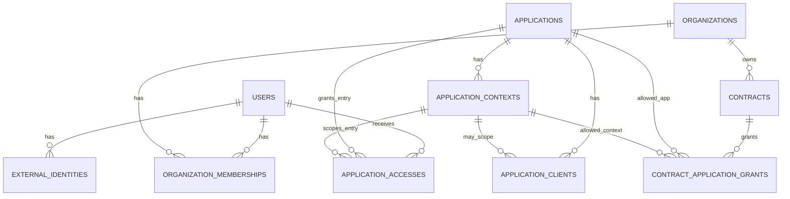

# Modelo logico e fisico inicial de identidade e acesso do CORE

Este documento define o contrato logico/fisico inicial de dados do SICODE CORE para orientar migrations futuras. Ele nao e migration, nao cria Models e nao implementa autenticacao.

## 1. Objetivo

Transformar o modelo conceitual aprovado em tabelas, chaves, cardinalidades, restricoes, indices, estados e invariantes de persistencia.

## 2. Fontes normativas

- `docs/architecture/core-identity-access-canon.md`
- `docs/architecture/core-identity-domain-model.md`
- `docs/architecture/core-application-authorization-boundaries.md`
- `docs/architecture/legacy-core-integration.md`
- `docs/architecture/legacy-to-core-transition-map.md`
- `docs/decisions/ADR-001-core-identity-authority-and-legacy-transition.md`
- `docs/inventory/legacy/legacy-identity-company-contract-authorization-inventory.md`

O canon e o ADR sao normativos. O mapa Legacy -> CORE define compatibilidade. O inventario Legacy e evidencia historica, nao modelo CORE.

## 3. Principios da modelagem fisica

OBRIGATORIO: proteger invariantes estruturais no PostgreSQL, nao apenas no Laravel.

OBRIGATORIO: nao incluir permissao operacional no CORE.

PROIBIDO: criar `legacy_user_id`, `legacy_company_id`, `company_id` em `users`, flags Legacy, `service/dispatch` ou campos ES/SP no `User`.

OBRIGATORIO: compatibilidade Legacy deve usar `external_identities` e projecoes locais nas aplicacoes.

OBRIGATORIO: autorizacao efetiva deve ser derivada, nao materializada em tabela nesta fase.

## 4. Politica de identificadores

Todas as entidades persistidas deste dominio usam `uuid` PostgreSQL como chave primaria.

Justificativa:

- o identificador sera exposto em contratos externos;
- evita acoplamento a sequencias locais;
- permite geracao distribuida controlada;
- e coerente com a decisao canonica de identidade global;
- evita misturar `bigint`, UUID e ULID sem necessidade de dominio.

Padrao:

- tipo logico: `uuid`;
- geracao: pelo PostgreSQL via `gen_random_uuid()` nas migrations CORE atuais;
- nao usar UUID Legacy como `CORE User.id`;
- IDs externos ficam em `external_identities.external_subject`.

## 4.1. Contrato Eloquent para UUID gerado pelo PostgreSQL

Os Models canônicos do CORE que representam estas tabelas devem estender `App\Models\CoreModel`.

Contrato:

- `id` permanece `uuid` PostgreSQL com default `gen_random_uuid()`;
- o Model permanece com chave primaria string e nao incremental (`$keyType = 'string'`, `$incrementing = false`);
- a autoridade de geracao do identificador e o PostgreSQL, nao a aplicacao Laravel;
- `HasUuids`, `HasUlids` ou geracao equivalente na aplicacao nao devem ser usados sem ADR alterando esta decisao;
- quando o atributo `id` ainda nao estiver definido, `CoreModel` usa o caminho `insertGetId`/`RETURNING id` do PostgreSQL para hidratar o UUID retornado pelo banco apos o `INSERT`.

Lifecycle observado:

- eventos `saving` e `creating` ocorrem antes do `INSERT`; portanto ainda nao devem depender de `id`;
- eventos `created` e `saved` ocorrem apos a hidratacao do UUID retornado pelo PostgreSQL;
- ao final de `create()` ou `save()`, `exists` esta `true`, `wasRecentlyCreated` esta `true`, `getKey()` retorna o UUID e os atributos originais ficam sincronizados.

## 5. Entidades persistidas

As seguintes entidades exigem tabela propria:

- `users`
- `local_password_credentials`
- `external_identities`
- `organizations`
- `organization_memberships`
- `contracts`
- `applications`
- `application_clients`
- `application_contexts`
- `application_accesses`
- `contract_application_grants`

Todas possuem identidade propria, lifecycle proprio ou relacionamento N:N com atributos.

## 6. Conceitos nao persistidos

- Autorizacao efetiva: derivada em tempo de decisao.
- Vínculo principal global: nao persistido nesta fase.
- `ApplicationInstance`: adiado ate haver governanca de deploy/runtime.
- `IdentityProvider`: nao persistido nesta fase; `provider` e string controlada.
- RBAC/roles/permissions operacionais: pertencem as aplicacoes.
- Auditoria CORE: fundacao persistente em `core_audit_events`; eventos obrigatorios definidos e gravacao explicita por capability.
- Politica generica de acesso: representada por booleans simples em `applications` e `application_contexts`.

## 7. Modelo de `users`

Tabela: `users`

Representa identidade humana canonica.

E-mail nao e identidade global absoluta. Ele pode ser usado como atributo canonico e auxiliar de login, mas a identidade global e `users.id`. O mapa de transicao proibe inferir identidade por e-mail Legacy isolado.

`primary_email` e nullable para suportar identidades provisionadas por IdP sem e-mail confiavel ou usuarios em migracao controlada. Quando presente, deve ser normalizado para comparacao case-insensitive.

Decisao: `primary_email` nao sera unico globalmente nesta fase. E-mail e atributo de contato/login auxiliar, nao identidade canonica. Unicidade de e-mail pode ser exigida em um fluxo de autenticacao especifico no futuro, mas nao deve impedir vinculos por IdP nem reconciliacao controlada.

Status minimo:

- `active`: usuario pode ser considerado em decisoes de acesso.
- `blocked`: bloqueio administrativo ou seguranca; novas entradas negadas.
- `disabled`: identidade desativada/desligada; novas entradas negadas.

Nao incluir `pending_migration` nesta fase porque migracao Legacy e representada por `ExternalIdentity` e ausencia/presenca de projecao local.

## 7.1. Modelo de `local_password_credentials`

Tabela: `local_password_credentials`

Representa credencial local de senha associada a um `User` CORE. Identidade canonica nao e credencial: `users` permanece sem `password`, `password_hash`, `remember_token` ou contrato `Authenticatable`.

Cardinalidade inicial:

```text
User 1 -> 0..1 LocalPasswordCredential
```

Campos:

- `id`: UUID gerado pelo PostgreSQL;
- `user_id`: FK para `users`;
- `password_hash`: hash irreversivel produzido pelo hashing oficial do Laravel;
- `status`: `active` ou `disabled`;
- `password_changed_at`;
- `invalidated_at`;
- timestamps.

Invariantes:

- unico por `user_id`;
- `active` exige `invalidated_at IS NULL`;
- `disabled` exige `invalidated_at IS NOT NULL`;
- hash nao pode ser vazio;
- hash nao deve ser indexado.

Nao incluir salt separado, pepper, remember token, reset token, historico de senha, contadores de falha, lockout, MFA, passkeys ou dados de federacao nesta tabela.

## 8. Modelo de `external_identities`

Tabela: `external_identities`

Representa vinculo entre um `User` CORE e uma identidade externa.

`provider` deve ser string controlada por allowlist de aplicacao nesta fase. Nao ha tabela `identity_providers` porque ainda nao ha lifecycle administrativo proprio para providers.

Chave logica obrigatoria:

```text
provider + provider_context + external_subject
```

Um `ExternalIdentity` nao pode trocar de `user_id` por atualizacao direta. Reconciliacao manual deve encerrar/revogar o vinculo anterior e criar novo registro ou registrar evento de reconciliacao com trilha auditavel. A regra canonica e imutabilidade logica do vinculo ativo.

## 9. Modelo de `organizations`

Tabela: `organizations`

Representa entidade institucional. `document` nao deve ser `cnpj`, pois o ecossistema pode representar organizacoes com outros documentos ou sem documento conhecido durante migracao.

Modelo fisico:

- `document_type`: string nullable controlada.
- `document_value`: string nullable normalizada quando conhecido.

Unicidade de documento so se aplica quando ambos existem.

## 10. Modelo de `organization_memberships`

Tabela: `organization_memberships`

Representa vinculo temporal entre usuario e organizacao. Nao reproduz `users.company_id`.

Decisao sobre vinculo principal:

| Alternativa | Decisao | Motivo |
| --- | --- | --- |
| `is_primary` no membership | Rejeitada agora | Criaria principalidade global e repetiria simplificacao de `users.company_id`. |
| tipo de vinculo | Adiada | Tipos exigem taxonomia de negocio ainda nao aprovada. |
| principal no `ApplicationAccess` | Adiada | Mistura entrada em aplicacao com relacao institucional. |
| regra derivada por contexto | Escolhida | Preserva multiplos vinculos e permite decisao por aplicacao/contexto. |
| nao modelar principalidade | Parcialmente escolhida | Nenhuma coluna de principalidade nesta fase. |

Um usuario pode possuir zero, um ou varios memberships ativos. A aplicacao que exigir um vinculo efetivo deve receber essa decisao por regra transacional do CORE, nao por uma flag global.

`status` e `ended_at` nao podem produzir estados impossiveis:

- `active` exige `ended_at IS NULL`;
- `ended` exige `ended_at IS NOT NULL`;
- `suspended` exige `ended_at IS NULL`.

Sobreposicao de periodos para o mesmo usuario/organizacao nao deve ser permitida para memberships ativos. Sobreposicao historica complexa deve ser validada transacionalmente.

## 11. Modelo de `contracts`

Tabela: `contracts`

Representa contrato institucional de uma organizacao. Nao usa a estrutura fisica Legacy.

Status minimo:

- `draft`: contrato cadastrado, ainda sem efeito de acesso.
- `active`: contrato pode ser considerado para grants.
- `suspended`: contrato existe, mas nao autoriza acesso.
- `ended`: contrato encerrado.

Vigencia temporal e status sao conceitos separados:

```text
temporally_valid = starts_at <= now AND (ends_at IS NULL OR ends_at >= now)
contract_effective = status = active AND temporally_valid
```

Contratos sobrepostos para a mesma organizacao sao permitidos. Nao ha requisito para unicidade de contrato ativo por organizacao.

## 12. Modelo de `applications`

Tabela: `applications`

Representa produto logico: `sicode-legacy`, `sicodesk`, `sicode-2`.

`code` e identificador estavel de integracao:

- lowercase;
- formato `^[a-z0-9][a-z0-9-]*$`;
- unico;
- imutavel logicamente depois de usado.

URL nao e identidade da aplicacao.

## 13. Analise `application_clients`

Tabela: `application_clients`

Entidade propria porque um produto pode ter multiplos clientes de autenticacao. Exemplo: SICODE Legacy ES e SICODE Legacy SP possuem clientes distintos.

Necessario agora:

- `application_id`;
- `context_id` nullable;
- `client_identifier`;
- `name`;
- `type`;
- `status`;
- `redirect_uris`;
- timestamps.

Reservado para capability OAuth/OIDC futura, sem coluna placeholder agora:

- segredo de client;
- JWKS privado/publico de client;
- grant types detalhados;
- rotacao de segredo;
- politicas avancadas.

PROIBIDO: armazenar segredo em texto puro.

## 14. Analise `application_contexts`

Tabela: `application_contexts`

Entidade propria porque ES/SP sao fronteiras independentes de autorizacao e segregacao operacional, nao apenas clients OAuth.

| Conceito | Identidade logica | Autorizacao | OAuth/OIDC | Deployment |
| --- | --- | --- | --- | --- |
| Application | Produto logico | Pode definir default de entrada | Nao e client | Nao representa runtime |
| ApplicationClient | Cliente de autenticacao | Identifica quem pede tokens | Sim | Nao representa segregacao de dados por si |
| ApplicationContext | Fronteira operacional | Sim, e alvo de grants/acessos | Pode ser associado a clients | Nao e deployment fisico |

Respostas:

- um Client pode existir sem Context: sim, para aplicacoes sem segregacao operacional;
- um Context pode possuir multiplos Clients: sim;
- ES/SP sao Contexts e tambem terao Clients proprios;
- autorizacao usa Application + Context;
- protocolo de autenticacao usa ApplicationClient;
- segregacao operacional e representada por ApplicationContext.

## 15. Modelo de `application_accesses`

Tabela: `application_accesses`

Representa direito individual de entrada.

Alternativas:

| Alternativa | Decisao | Motivo |
| --- | --- | --- |
| `application_id` + `context_id nullable` | Escolhida | Permite acesso a aplicacao sem contexto e acesso especifico ES/SP. |
| tabela somente por context | Rejeitada | Nao cobre bem aplicacoes sem contexto. |
| entidades separadas | Rejeitada | Duplica regras e queries. |

O acesso pode ser concedido para Application sem contexto ou para ApplicationContext especifico. Para SICODE Legacy ES/SP, o acesso deve ser por contexto.

Nao adicionar `role`, `permission` ou `abilities`.

## 16. Modelo de `contract_application_grants`

Tabela: `contract_application_grants`

Representa direito institucional de uma organizacao/contrato usar aplicacao ou contexto.

O grant pode ser para:

- Application sem contexto, quando a aplicacao nao tiver segregacao operacional relevante;
- ApplicationContext especifico, quando ES/SP ou equivalente importarem.

Exemplo: contrato permite SICODE Legacy ES e nao SP usando `application_id = sicode-legacy` e `context_id = ES`.

`ApplicationAccess` = individuo allowed.

`ContractApplicationGrant` = instituicao/contrato allowed.

`grant_source` nao entra no modelo inicial. A fonte da concessao deve ser auditada por evento obrigatorio; criar coluna sem contrato de negocio agora adicionaria ambiguidade.

## 17. Politica de requisitos de entrada

Aplicacoes/contextos declaram requisitos simples, sem motor generico.

Decisao:

- colunas em `applications` para defaults;
- colunas em `application_contexts` para override por contexto.

Colunas:

- `requires_organization`;
- `requires_contract`.

Em `application_contexts`, os campos sao nullable:

- `NULL` herda o default da aplicacao;
- `true/false` sobrescreve.

Isso permite SICODESK e Legacy ES/SP sem criar entidade de policy.

## 18. Catalogo de estados

Representacao fisica escolhida: `varchar` + `CHECK constraint`.

Justificativa:

- mais facil evoluir que PostgreSQL ENUM;
- mais protegido que validacao apenas na aplicacao;
- compatilvel com Laravel migrations sem acoplamento forte a tipos nativos.

| Entidade | Estado | Significado | Transicoes |
| --- | --- | --- | --- |
| User | active | Identidade apta a entrada | active -> blocked/disabled |
| User | blocked | Bloqueio de seguranca/administrativo | blocked -> active/disabled |
| User | disabled | Identidade desativada | disabled -> active apenas com auditoria |
| ExternalIdentity | active | Vinculo externo valido | active -> revoked/archived |
| ExternalIdentity | revoked | Vinculo encerrado por correcao/reconciliacao | terminal operacional |
| ExternalIdentity | archived | Mantido apenas para historico | terminal operacional |
| Organization | active | Instituicao apta | active -> suspended/disabled |
| Organization | suspended | Temporariamente impedida | suspended -> active/disabled |
| Organization | disabled | Encerrada/desativada | disabled -> active apenas com auditoria |
| OrganizationMembership | active | Vinculo vigente | active -> suspended/ended |
| OrganizationMembership | suspended | Vinculo pausado | suspended -> active/ended |
| OrganizationMembership | ended | Vinculo encerrado | terminal operacional |
| Contract | draft | Sem efeito de acesso | draft -> active/ended |
| Contract | active | Pode autorizar grants se vigente | active -> suspended/ended |
| Contract | suspended | Nao autoriza acesso | suspended -> active/ended |
| Contract | ended | Encerrado | terminal operacional |
| Application | active | Disponivel para avaliacao | active -> disabled |
| Application | disabled | Nao autoriza novas entradas | disabled -> active |
| ApplicationClient | active | Pode autenticar | active -> disabled |
| ApplicationClient | disabled | Nao pode autenticar | disabled -> active |
| ApplicationContext | active | Contexto disponivel | active -> disabled |
| ApplicationContext | disabled | Contexto indisponivel | disabled -> active |
| ApplicationAccess | active | Direito individual vigente | active -> suspended/revoked |
| ApplicationAccess | suspended | Direito pausado | suspended -> active/revoked |
| ApplicationAccess | revoked | Direito encerrado | terminal operacional |
| ContractApplicationGrant | active | Grant institucional vigente | active -> suspended/revoked |
| ContractApplicationGrant | suspended | Grant pausado | suspended -> active/revoked |
| ContractApplicationGrant | revoked | Grant encerrado | terminal operacional |

## 19. Constraints

Constraints estruturais obrigatorias:

- PK UUID em todas as tabelas.
- FK de todas as referencias internas.
- `users.status IN ('active','blocked','disabled')`.
- `users.primary_email_normalized` indexado quando nao nulo, sem unique global inicial.
- `external_identities(provider, provider_context, external_subject)` unique.
- `external_identities.status IN ('active','revoked','archived')`.
- `organizations(document_type, document_value)` unique parcial quando ambos nao nulos.
- `organization_memberships.ended_at >= started_at` quando `ended_at` nao nulo.
- `organization_memberships` check de coerencia entre `status` e `ended_at`.
- `contracts.ends_at >= starts_at` quando `ends_at` nao nulo.
- `applications.code` unique e check de formato.
- `application_contexts(application_id, code)` unique.
- `application_clients.client_identifier` unique.
- `application_accesses` check: `context_id` nulo ou pertence a mesma `application_id`.
- `contract_application_grants` check equivalente de contexto/aplicacao.
- `starts_at <= ends_at` para accesses/grants quando `ends_at` nao nulo.
- unique parcial para uma concessao ativa equivalente em `application_accesses(user_id, application_id, context_id)`, tratando `context_id NULL` por indice de expressao ou regra equivalente.
- unique parcial para um grant ativo equivalente em `contract_application_grants(contract_id, application_id, context_id)`, tratando `context_id NULL` por indice de expressao ou regra equivalente.

Observacao: checks que comparam `context_id` com `application_id` exigem trigger ou constraint transacional, pois CHECK nao consulta outra tabela. A invariante e obrigatoria, mas a tecnica exata fica para a migration.

## 20. Indices

Indices obrigatorios:

- `users(primary_email_normalized)` parcial nao unico quando nao nulo.
- `users(status)`.
- `external_identities(provider, provider_context, external_subject)` unique.
- `external_identities(user_id, provider, provider_context)`.
- `organizations(document_type, document_value)` unique parcial.
- `organization_memberships(user_id, status)`.
- `organization_memberships(organization_id, status)`.
- `contracts(organization_id, status)`.
- `contracts(organization_id, starts_at, ends_at)`.
- `applications(code)` unique.
- `application_contexts(application_id, code)` unique.
- `application_clients(client_identifier)` unique.
- `application_clients(application_id, context_id, status)`.
- `application_accesses(user_id, application_id, context_id, status)`.
- `contract_application_grants(contract_id, application_id, context_id, status)`.

## 21. Estrategia de delecao

| Entidade | Estrategia | Justificativa |
| --- | --- | --- |
| User | STATUS-BASED LIFECYCLE | Autoridade de identidade; nao apagar historico. |
| ExternalIdentity | IMMUTABLE/HISTORICAL | Rastreabilidade de migracao e IdP. |
| Organization | STATUS-BASED LIFECYCLE | Contratos e memberships historicos dependem dela. |
| OrganizationMembership | IMMUTABLE/HISTORICAL | Historico temporal de vinculo. |
| Contract | STATUS-BASED LIFECYCLE | Contrato deve ser auditavel. |
| Application | STATUS-BASED LIFECYCLE | Codigo externo nao deve desaparecer. |
| ApplicationClient | STATUS-BASED LIFECYCLE | Revogacao sem apagar historico. |
| ApplicationContext | STATUS-BASED LIFECYCLE | ES/SP e outros contextos devem preservar rastreabilidade. |
| ApplicationAccess | IMMUTABLE/HISTORICAL | Concessoes/revogacoes devem ser auditaveis. |
| ContractApplicationGrant | IMMUTABLE/HISTORICAL | Grants institucionais devem ser auditaveis. |

Soft delete Laravel nao e padrao para este dominio. Lifecycle deve ser por status e datas.

## 22. Eventos auditaveis obrigatorios

- Criacao, bloqueio, desbloqueio e desativacao de User.
- Alteracao de `primary_email` e nome canonico.
- Criacao, revogacao, arquivamento e reconciliacao de ExternalIdentity.
- Criacao, suspensao, reativacao e encerramento de OrganizationMembership.
- Criacao, ativacao, suspensao e encerramento de Contract.
- Criacao/desativacao de Application, ApplicationClient e ApplicationContext.
- Concessao, suspensao, reativacao e revogacao de ApplicationAccess.
- Criacao, suspensao, reativacao e revogacao de ContractApplicationGrant.
- Alteracao de requisitos de entrada em Application/ApplicationContext.

A fundacao persistente de auditoria fica em `core_audit_events` e deve ser usada explicitamente pelos casos de uso criticos futuros. Os eventos listados ja sao obrigatorios para mutacoes criticas.

## 23. Relacionamento com Legacy

O CORE nao possui campos Legacy nas entidades canonicas.

Compatibilidade:

- Legacy ES/SP entram por `external_identities`.
- `provider = sicode-legacy`.
- `provider_context = ES` ou `SP`.
- `external_subject = users.id` local do respectivo banco.

Nenhum dado de permissao Legacy entra no CORE.

## 24. Preparacao SICODESK

SICODESK precisa apenas de:

- `users.id`;
- status global;
- direito de entrada por `application_accesses`;
- organizacao/contrato quando configurado como requisito;
- projecao local minima propria.

SICODESK nao depende de Legacy.

## 25. Preparacao SICODE 2.0

SICODE 2.0 deve consumir `users`, `organizations`, `organization_memberships`, `contracts`, `applications`, `application_contexts`, `application_accesses` e grants por contratos externos.

Nao depende de `LegacyCoreIdentityBridge` nem de IDs Legacy.

## 26. Modelo relacional consolidado



## 27. Dicionario de dados

### `users`

| Coluna | Tipo logico | Nulo | Restricao | Significado |
| --- | --- | --- | --- | --- |
| id | uuid | nao | PK | Identidade canonica |
| display_name | string | nao | | Nome canonico exibivel |
| primary_email | string | sim | | E-mail principal informado |
| primary_email_normalized | string | sim | index parcial | E-mail normalizado para busca case-insensitive |
| status | string | nao | CHECK | Lifecycle da identidade |
| created_at | timestamp | nao | | Criacao |
| updated_at | timestamp | nao | | Atualizacao |

### `external_identities`

| Coluna | Tipo logico | Nulo | Restricao | Significado |
| --- | --- | --- | --- | --- |
| id | uuid | nao | PK | Identidade do vinculo |
| user_id | uuid | nao | FK users | Usuario CORE |
| provider | string | nao | unique composto | Provider externo |
| provider_context | string | nao | unique composto | Contexto do provider |
| external_subject | string | nao | unique composto | Identificador externo |
| status | string | nao | CHECK | Estado do vinculo |
| linked_at | timestamp | nao | | Data do vinculo |
| last_seen_at | timestamp | sim | | Ultima observacao |
| created_at | timestamp | nao | | Criacao |
| updated_at | timestamp | nao | | Atualizacao |

### `organizations`

| Coluna | Tipo logico | Nulo | Restricao | Significado |
| --- | --- | --- | --- | --- |
| id | uuid | nao | PK | Identidade institucional |
| name | string | nao | | Nome curto/exibicao |
| legal_name | string | sim | | Razao/nome legal |
| document_type | string | sim | unique composto parcial | Tipo do documento |
| document_value | string | sim | unique composto parcial | Documento normalizado |
| status | string | nao | CHECK | Lifecycle |
| created_at | timestamp | nao | | Criacao |
| updated_at | timestamp | nao | | Atualizacao |

### `organization_memberships`

| Coluna | Tipo logico | Nulo | Restricao | Significado |
| --- | --- | --- | --- | --- |
| id | uuid | nao | PK | Identidade do vinculo |
| user_id | uuid | nao | FK users | Usuario |
| organization_id | uuid | nao | FK organizations | Organizacao |
| status | string | nao | CHECK | Estado do vinculo |
| started_at | timestamp | nao | CHECK temporal | Inicio |
| ended_at | timestamp | sim | CHECK temporal | Encerramento |
| created_at | timestamp | nao | | Criacao |
| updated_at | timestamp | nao | | Atualizacao |

### `contracts`

| Coluna | Tipo logico | Nulo | Restricao | Significado |
| --- | --- | --- | --- | --- |
| id | uuid | nao | PK | Identidade do contrato |
| organization_id | uuid | nao | FK organizations | Organizacao contratante/relacionada |
| identifier | string | sim | index | Numero/codigo institucional |
| status | string | nao | CHECK | Estado contratual |
| starts_at | timestamp | nao | CHECK temporal | Inicio de vigencia |
| ends_at | timestamp | sim | CHECK temporal | Fim de vigencia |
| created_at | timestamp | nao | | Criacao |
| updated_at | timestamp | nao | | Atualizacao |

### `applications`

| Coluna | Tipo logico | Nulo | Restricao | Significado |
| --- | --- | --- | --- | --- |
| id | uuid | nao | PK | Identidade da aplicacao |
| code | string | nao | unique + CHECK | Codigo estavel |
| name | string | nao | | Nome exibivel |
| status | string | nao | CHECK | Estado |
| requires_organization | boolean | nao | default false | Requisito default |
| requires_contract | boolean | nao | default false | Requisito default |
| created_at | timestamp | nao | | Criacao |
| updated_at | timestamp | nao | | Atualizacao |

### `application_contexts`

| Coluna | Tipo logico | Nulo | Restricao | Significado |
| --- | --- | --- | --- | --- |
| id | uuid | nao | PK | Identidade do contexto |
| application_id | uuid | nao | FK applications | Aplicacao |
| code | string | nao | unique composto + CHECK | Codigo do contexto |
| name | string | nao | | Nome exibivel |
| status | string | nao | CHECK | Estado |
| requires_organization | boolean | sim | | Override/heranca |
| requires_contract | boolean | sim | | Override/heranca |
| created_at | timestamp | nao | | Criacao |
| updated_at | timestamp | nao | | Atualizacao |

### `application_clients`

| Coluna | Tipo logico | Nulo | Restricao | Significado |
| --- | --- | --- | --- | --- |
| id | uuid | nao | PK | Identidade do client |
| application_id | uuid | nao | FK applications | Aplicacao |
| context_id | uuid | sim | FK application_contexts | Contexto associado |
| client_identifier | string | nao | unique | Identificador OAuth/OIDC futuro |
| name | string | nao | | Nome exibivel |
| type | string | nao | CHECK | public/confidential/native/etc. |
| status | string | nao | CHECK | Estado |
| redirect_uris | text array ou tabela futura | sim | | URIs permitidas iniciais |
| created_at | timestamp | nao | | Criacao |
| updated_at | timestamp | nao | | Atualizacao |

### `application_accesses`

| Coluna | Tipo logico | Nulo | Restricao | Significado |
| --- | --- | --- | --- | --- |
| id | uuid | nao | PK | Identidade da concessao |
| user_id | uuid | nao | FK users | Usuario autorizado |
| application_id | uuid | nao | FK applications | Aplicacao |
| context_id | uuid | sim | FK application_contexts | Contexto especifico |
| status | string | nao | CHECK | Estado |
| starts_at | timestamp | nao | CHECK temporal | Inicio |
| ends_at | timestamp | sim | CHECK temporal | Fim |
| created_at | timestamp | nao | | Criacao |
| updated_at | timestamp | nao | | Atualizacao |

### `contract_application_grants`

| Coluna | Tipo logico | Nulo | Restricao | Significado |
| --- | --- | --- | --- | --- |
| id | uuid | nao | PK | Identidade do grant |
| contract_id | uuid | nao | FK contracts | Contrato |
| application_id | uuid | nao | FK applications | Aplicacao autorizada |
| context_id | uuid | sim | FK application_contexts | Contexto autorizado |
| status | string | nao | CHECK | Estado |
| starts_at | timestamp | nao | CHECK temporal | Inicio |
| ends_at | timestamp | sim | CHECK temporal | Fim |
| created_at | timestamp | nao | | Criacao |
| updated_at | timestamp | nao | | Atualizacao |

## 28. Matriz de cardinalidade

| Origem | Relacao | Destino | Cardinalidade |
| --- | --- | --- | --- |
| User | possui | ExternalIdentity | 1:N |
| User | possui | OrganizationMembership | 1:N |
| Organization | possui | OrganizationMembership | 1:N |
| Organization | firma | Contract | 1:N |
| Application | possui | ApplicationContext | 1:N |
| Application | possui | ApplicationClient | 1:N |
| ApplicationContext | escopa | ApplicationClient | 0:N |
| User | recebe | ApplicationAccess | 1:N |
| Application | alvo de | ApplicationAccess | 1:N |
| ApplicationContext | escopa | ApplicationAccess | 0:N |
| Contract | concede | ContractApplicationGrant | 1:N |
| Application | alvo de | ContractApplicationGrant | 1:N |
| ApplicationContext | escopa | ContractApplicationGrant | 0:N |

## 29. Matriz de autoridade

| Conceito | CORE | Aplicacao | Derivado |
| --- | --- | --- | --- |
| Identidade global | sim | nao | nao |
| Nome/email canonico | sim | projecao local | nao |
| Senha/OIDC futuro | sim | nao para ecossistema | nao |
| Identidade externa | sim | origem factual | nao |
| Organizacao institucional | sim | projecao local | nao |
| Membership institucional | sim | projecao local | nao |
| Contrato institucional | sim | projecao local | nao |
| Entrada em aplicacao/contexto | sim | nao | nao |
| Permissoes operacionais | nao | sim | nao |
| Autorizacao efetiva | nao materializada | nao | sim |

## 30. Invariantes de persistencia

- Todo registro persistido tem UUID proprio.
- `User` nao referencia empresa diretamente.
- `ExternalIdentity` e unica por provider/context/subject.
- `ApplicationAccess` nunca contem role/permission operacional.
- `ContractApplicationGrant` nunca substitui `ApplicationAccess`.
- Contexto usado em access/grant/client deve pertencer a mesma application.
- `ended_at`/`ends_at` nao pode anteceder `started_at`/`starts_at`.
- Status e datas nao podem se contradizer em memberships.
- Aplicacoes sem contexto podem usar `context_id NULL`; Legacy ES/SP devem usar contexto.

## 31. Regras transacionais da aplicacao

Estas regras nao devem depender apenas de constraint simples:

- impedir periodos ativos sobrepostos para mesmo usuario/organizacao quando a regra de negocio exigir;
- avaliar autorizacao efetiva combinando usuario, access, membership, contrato, grant e requisitos da aplicacao/contexto;
- reconciliar identidades externas com aprovacao auditavel;
- validar que contexto pertence a aplicacao em clients/accesses/grants se nao for implementado por trigger;
- impedir mutacao logica de `applications.code` e `external_identities.user_id` sem processo de auditoria;
- decidir membership efetivo quando um usuario possui multiplos vinculos ativos;
- normalizar email e documentos antes da persistencia;
- avaliar expiracao temporal em conjunto com status.

## 32. Testes mentais

| Cenario | Resultado |
| --- | --- |
| A: usuario sem organizacao acessa app que nao exige contrato | Permitido se User active e ApplicationAccess efetivo existir. |
| B: usuario vinculado a Organization A acessa SICODESK | Permitido se SICODESK tiver access ativo e requisitos de org/contrato forem satisfeitos. |
| C: usuario tem Legacy ES allowed e SP denied | Representado por dois contexts; access ativo apenas para ES. |
| D: contrato autoriza ES, usuario sem ApplicationAccess | Negado; grant institucional nao substitui access individual. |
| E: usuario tem ApplicationAccess, contrato expirou | Negado quando contrato for exigido; vigencia e status do contrato entram na derivacao. |
| F: Legacy ES user 152 e SP user 152 | Sem colisao por provider_context diferente. |
| G: mesmo CORE User possui ES e SP externos | Permitido por multiplos ExternalIdentity para mesmo user. |
| H: usuario bloqueado globalmente | Negado; `users.status = blocked` impede novas entradas. |
| I: Legacy aposentado | ExternalIdentities podem permanecer historicas; SICODESK/SICODE 2.0 nao quebram. |
| J: Entra ID integrado | Novo provider em external_identities; User nao muda estruturalmente. |

## 33. Decisoes adiadas

- Implementacao dos casos de uso que gravam auditoria nas mutacoes criticas.
- Implementacao OAuth/OIDC, segredos de client e rotacao.
- `ApplicationInstance`.
- Tabela `identity_providers`.
- Taxonomia de tipos de organizacao e membership.
- Modelagem fisica de credenciais/fatores de autenticacao.
- Estrategia exata para redirect URIs: array inicial ou tabela normalizada.
- Triggers/exclusion constraints para periodos sobrepostos.
