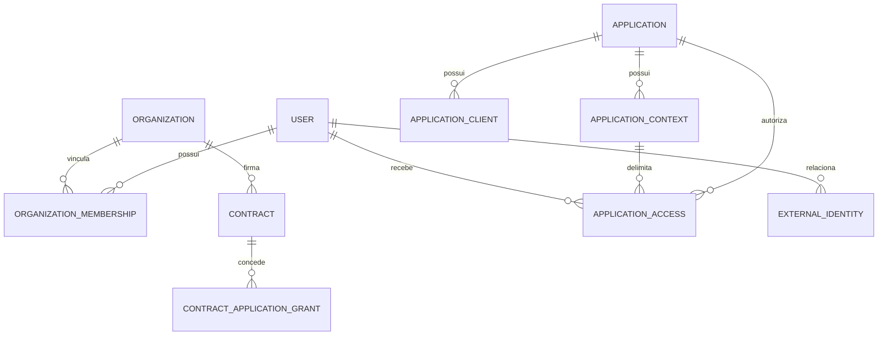
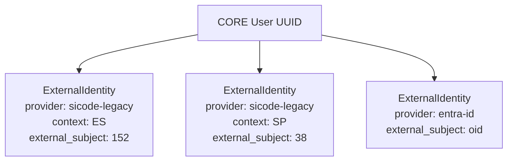

# Modelo de dominio de identidade e acesso do CORE

Este documento detalha entidades canonicas, responsabilidades, relacionamentos, invariantes e ciclo de vida. Ele complementa o canon arquitetural.

## Decisoes semanticas

O termo canonico para entidade institucional e `organization`.

Justificativa: `company` e restrito demais para representar empresa interna, prestadora, consultoria, fornecedor, parceiro e outras entidades. `tenant` descreve isolamento tecnico, nao necessariamente a instituicao participante. `organization` representa melhor a relacao juridica, operacional e institucional.

## Entidades canonicas

### User

Identidade humana global no CORE.

Responsavel por:

- identificador canonico estavel;
- atributos de identidade cujo CORE for autoridade;
- estado da identidade;
- autenticacao e fatores associados, quando implementados.

Campos conceituais minimos:

- `id` UUID;
- `display_name`;
- `primary_email`;
- `status`;
- `created_at`;
- `updated_at`;
- `disabled_at`.

Estados:

- `active`;
- `disabled`;
- `pending_migration`;
- `closed`.

### Organization

Entidade institucional participante do ecossistema.

Exemplos:

- empresa interna;
- prestadora;
- consultoria;
- fornecedor;
- parceiro;
- orgao ou unidade operacional.

Campos conceituais minimos:

- `id` UUID;
- `legal_name`;
- `trade_name`;
- `document`;
- `type`;
- `status`.

### OrganizationMembership

Vinculo temporal entre usuario e organizacao.

Responsavel por:

- registrar inicio;
- registrar encerramento;
- indicar estado;
- indicar vinculo principal quando aplicavel.

Campos conceituais minimos:

- `id` UUID;
- `user_id`;
- `organization_id`;
- `status`;
- `started_at`;
- `ended_at`;
- `is_primary`;

### Contract

Vinculo institucional entre CORE/ecossistema e uma organizacao.

Contrato nao e atributo do usuario.

Campos conceituais minimos:

- `id` UUID;
- `organization_id`;
- `code`;
- `status`;
- `started_at`;
- `ended_at`;
- `suspended_at`.

Estados:

- `draft`;
- `active`;
- `suspended`;
- `ended`;
- `cancelled`.

### Application

Produto ou aplicacao logica do ecossistema.

Exemplos:

- `sicode-legacy`;
- `sicodesk`;
- `sicode-2`.

### ApplicationClient

Cliente de autenticacao associado a uma aplicacao.

Responsavel por:

- redirect URIs;
- credenciais;
- tipo de cliente;
- audiences permitidas;
- configuracao de OIDC/OAuth.

Exemplos:

- cliente web do Legacy ES;
- cliente web do Legacy SP;
- cliente web do SICODESK.

### ApplicationContext

Contexto operacional segregado dentro de uma aplicacao logica.

Exemplos:

- `ES`;
- `SP`.

Um contexto pode ter banco, storage, configuracao e autorizacao propria.

### ApplicationAccess

Autorizacao de entrada de um usuario a uma aplicacao, cliente e contexto.

Nao representa permissao operacional interna.

### ContractApplicationGrant

Autorizacao institucional para uma organizacao acessar uma aplicacao ou contexto por contrato.

Responsavel por:

- periodo de validade;
- status da autorizacao;
- aplicacao ou contexto autorizado;
- limites futuros documentados sem antecipar motor generico de politicas.

### ExternalIdentity

Vinculo entre uma identidade CORE e uma identidade externa.

Suporta:

- SICODE Legacy ES;
- SICODE Legacy SP;
- Azure AD / Microsoft Entra ID;
- outros IdPs;
- sistemas importados.

Campos conceituais minimos:

- `id` UUID;
- `user_id`;
- `provider`;
- `provider_context`;
- `external_subject`;
- `status`;
- `linked_at`;
- `last_seen_at`;
- `metadata`;

Unicidade logica:

```text
provider + provider_context + external_subject
```

Justificativa: `external_subject = 152` pode existir simultaneamente no Legacy ES e no Legacy SP.

## Matriz de aplicacoes, clientes, contextos e instancias

| Conceito | Significado | Responsabilidade | Quando existe | Exemplo |
| --- | --- | --- | --- | --- |
| Application | Produto logico | Nomeia o sistema consumidor | Sempre que houver sistema do ecossistema | SICODE Legacy |
| ApplicationClient | Cliente OAuth/OIDC | Credenciais, redirect URI, audience | Quando uma aplicacao autentica no CORE | Legacy ES Web |
| ApplicationContext | Contexto operacional | Segregacao de autorizacao e dados | Quando o mesmo produto opera contextos distintos | ES, SP |
| ApplicationInstance | Implantacao fisica/runtime | URL, ambiente, infra, release | Quando for preciso governar deploy/operacao | Runtime Legacy SP producao |

RECOMENDADO: iniciar o dominio com Application, ApplicationClient e ApplicationContext.

PERMITIDO: introduzir ApplicationInstance posteriormente se governanca operacional exigir.

PROIBIDO: usar ApplicationInstance para representar direito de negocio se ApplicationContext for o conceito correto.

## Relacionamentos



## Modelo de identidade



## Invariantes

OBRIGATORIO: um usuario pode existir sem organizacao.

OBRIGATORIO: aplicacoes que exigem vinculo organizacional nao podem ser acessadas sem membership ativo.

OBRIGATORIO: para determinado contexto operacional, apenas um vinculo organizacional ativo pode ser considerado principal.

OBRIGATORIO: contrato pertence a organizacao, nao ao usuario.

OBRIGATORIO: contrato ativo nao concede acesso de usuario sem ApplicationAccess ativo.

OBRIGATORIO: ApplicationAccess ativo nao concede acesso se a organizacao exige contrato e nao ha grant contratual ativo.

OBRIGATORIO: identidade externa deve ser unica por provider, contexto e identificador externo.

OBRIGATORIO: atributos de identidade possuem uma autoridade unica definida.

PROIBIDO: dois sistemas serem simultaneamente autoridade pelo mesmo atributo de identidade.

## Projecao local de usuario

Aplicacoes podem manter projecao local minima para operacao.

Exemplo conceitual no Legacy:

```text
users.id              ID local historico
users.core_user_id    UUID canonico CORE
users.name            projecao do nome
users.email           projecao do email
```

Dados que podem ser projetados:

- `core_user_id`;
- nome de exibicao;
- email principal;
- estado resumido da identidade;
- timestamps de sincronizacao.

Autoridade:

- CORE e autoridade por identidade global, estado global, email principal e nome canonico quando definidos no CORE.
- Aplicacao e autoridade por preferencias locais, papeis internos e permissoes operacionais.

Mudancas de nome ou email:

- devem fluir do CORE para a aplicacao;
- podem ficar temporariamente defasadas em projecao local;
- nao devem ser atualizadas de volta para o CORE sem contrato explicito.

Usuario bloqueado no CORE:

- deve perder entrada em novas sessoes;
- sessoes existentes devem respeitar politica de revogacao definida pelo contrato de autenticacao;
- aplicacao pode manter registro historico local.

CORE temporariamente indisponivel:

- aplicacao pode usar cache de token ou sessao previamente validada ate o limite definido;
- aplicacao nao pode criar identidade global local para contornar indisponibilidade;
- novas autenticacoes devem falhar de modo controlado ou usar estrategia de contingencia aprovada em ADR.

