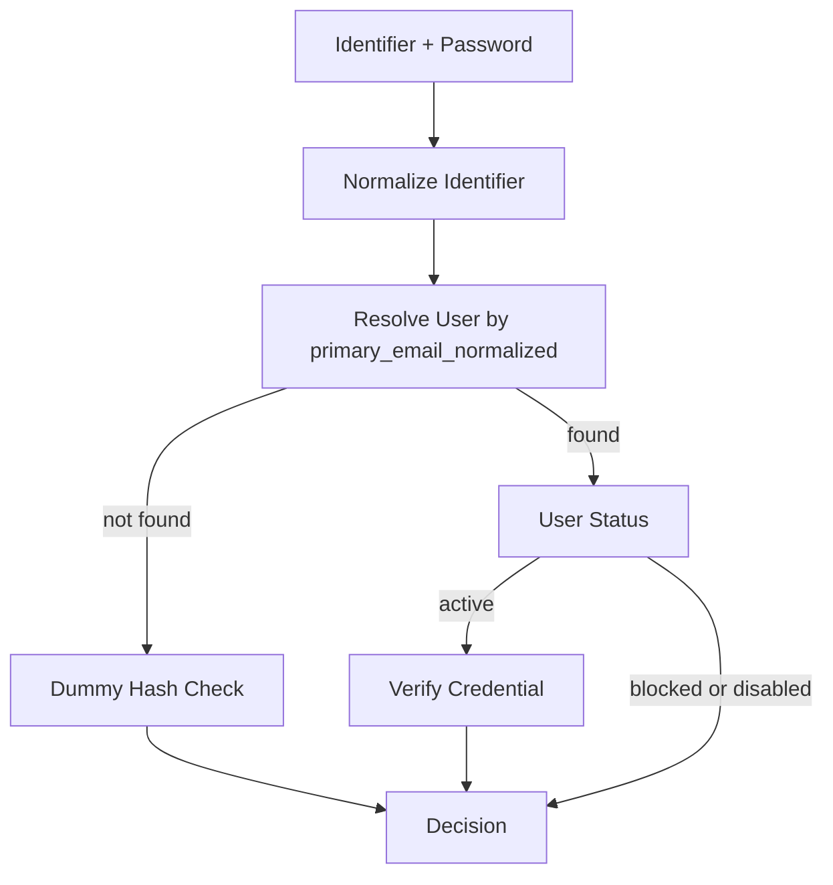
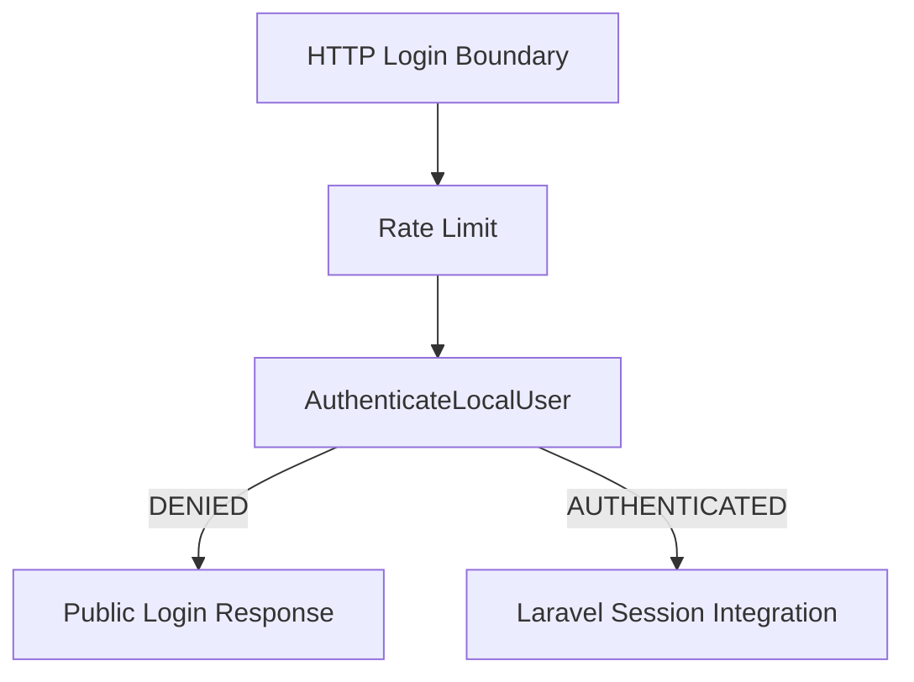
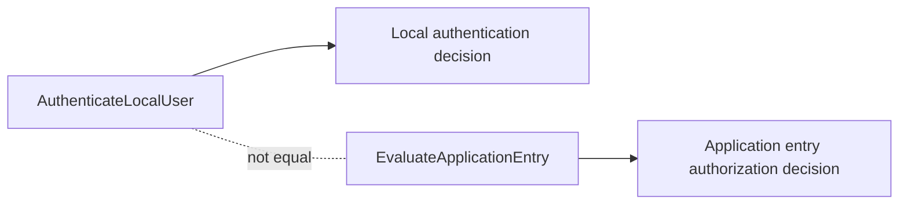

# SICODE CORE Local Authentication

## Responsibility

`AuthenticateLocalUser` answers one question: given a local identifier and a presented password, is there a canonical `User` allowed to authenticate locally in CORE?

It is an orchestration capability only. It does not create sessions, cookies, tokens, guards, controllers, redirects, audit events, notifications, or login-attempt records.

## Credential vs Authentication

`LocalPasswordCredential` stores the local password credential for a canonical `User`.

`VerifyLocalPasswordCredential` verifies an existing active credential for a known `User`.

`AuthenticateLocalUser` resolves the `User`, evaluates the global `User` state, delegates credential verification, and translates the result into a structured authentication decision.

## Local Identifier

The first local authentication flow accepts only `User.primary_email_normalized`.

The e-mail address is a discovery identifier for local authentication. It is not the canonical identity. The canonical identity remains the `User` UUID.

This capability does not use `ExternalIdentity`, username, matricula, CPF, document number, or any application-specific identifier.

## Normalization

The local login identifier is normalized with:

- `trim`
- `lowercase`

No provider-specific canonicalization is applied. The capability does not remove Gmail dots, remove plus tags, or treat domains as equivalent.

The rule is centralized in `LocalLoginIdentifierNormalizer` to avoid duplicated ad hoc normalization.

## Structured Decision

`LocalAuthenticationDecision` is immutable and contains:

- `authenticated`
- `reason`
- `user`
- `requiresPasswordRehash`

The `User` is present only when `authenticated` is true. Denied decisions never expose the resolved `User`, a `LocalPasswordCredential`, or a password hash.

## Reason Codes

The closed catalog is:

- `AUTHENTICATED`
- `INVALID_CREDENTIALS`
- `USER_NOT_ACTIVE`
- `LOCAL_CREDENTIAL_NOT_ACTIVE`

`USER_NOT_FOUND`, `PASSWORD_MISMATCH`, and `CREDENTIAL_NOT_FOUND` are deliberately not authentication decision reasons. They are collapsed to `INVALID_CREDENTIALS` to reduce user enumeration risk.

`LOCAL_CREDENTIAL_NOT_ACTIVE` is an internal decision reason. It must not be rendered directly as end-user copy without boundary-specific wording.

## Evaluation Flow

The deterministic order is:

1. Normalize identifier.
2. Resolve `User` by `primary_email_normalized`.
3. If the `User` is missing, execute the dummy hash strategy and return `INVALID_CREDENTIALS`.
4. If the `User` exists, evaluate global `User.status`.
5. If the `User` is active, call `VerifyLocalPasswordCredential`.
6. Translate the verification result.
7. Return `AUTHENTICATED` only after a successful credential verification.

## Anti-Enumeration and Dummy Hash

Resolving a nonexistent user can be much cheaper than checking an Argon2id password hash. For the missing-user path, the capability runs `Hasher::check` against a synthetic dummy hash produced by the configured Laravel hasher.

The dummy password is not a user password, is not persisted, is not treated as a credential, and is not logged. The generated dummy hash is cached inside `LocalAuthenticationDummyHash` for the lifetime of that collaborator instead of being generated for every authentication call.

This reduces a coarse timing difference between "user not found" and "wrong password for existing active user". It does not claim perfect timing attack resistance. The inactive-user path still returns before local credential verification because the global `User` state is authoritative for authentication eligibility.

## User Global State

The real `users.status` catalog is:

- `active`
- `blocked`
- `disabled`

Only `active` can authenticate locally. `blocked` and `disabled` return `USER_NOT_ACTIVE`.

The capability does not mutate `User`.

## Rehash

When `VerifyLocalPasswordCredential` returns a verified result with `requiresRehash = true`, `AuthenticateLocalUser` returns an authenticated decision with `requiresPasswordRehash = true`.

No rehash is executed here. A future login/session boundary may perform an explicit, auditable rehash after successful authentication.

## Audit

This capability does not write `CoreAuditEvent` directly.

Login security auditing belongs to the HTTP/session boundary, which has request context, session semantics and public response semantics.

Implemented boundary:

- `StartLocalSession` records `LOCAL_AUTHENTICATION_SUCCEEDED` for successful authentication.
- `StartLocalSession` records `LOCAL_AUTHENTICATION_REJECTED` for refused authentication.
- `EndLocalSession` records `LOCAL_SESSION_ENDED` when an authenticated local session is closed.

Rejected attempts use `LOCAL_AUTHENTICATION_ATTEMPT` as subject and the operation `correlation_id` as `subject_id`, avoiding exposure of a resolved user for invalid-credential paths. Audit details are allowlisted and contain the structured reason only, without password, hash, token, cookie, request payload or secret.

## Rate Limiting

Rate limiting is not implemented inside `AuthenticateLocalUser`.

The HTTP login boundary applies Laravel rate limiting before calling this capability, using the `local-login` limiter. The limiter key combines the normalized identifier and request IP.

## Laravel Session Boundary

This capability does not integrate with `Auth::attempt`, `Auth::login`, `SessionGuard`, `EloquentUserProvider`, `Authenticatable`, remember-me cookies, or custom guards.

Session integration boundary:

`StartLocalSession` stores the authenticated CORE user UUID in the Laravel session under a CORE-owned session key. It does not perform Application Entry authorization and does not use Laravel's Eloquent password provider.

## Application Entry Separation

`AuthenticateLocalUser` proves that a canonical `User` can authenticate locally.

`EvaluateApplicationEntry` decides whether a canonical `User` may enter an application in a given context.

Authentication does not consult applications, application access, contracts, memberships, grants, roles, or permissions.
