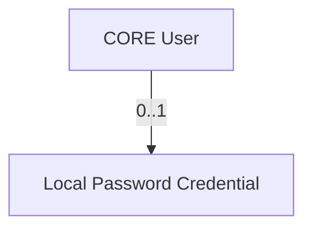
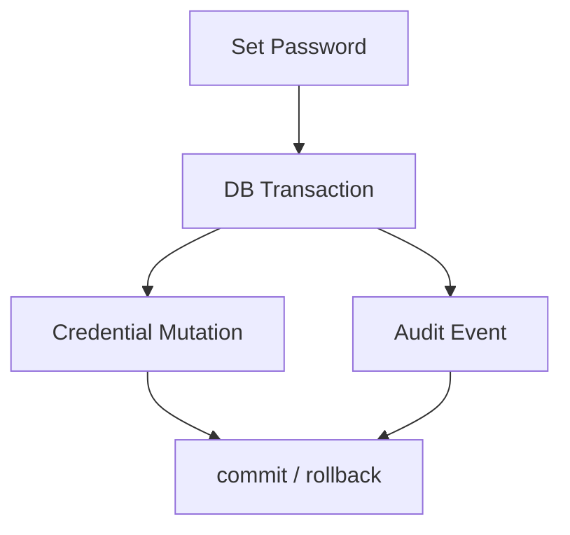

# Credenciais locais de senha do CORE

Este documento define a capability de credenciais locais de senha do SICODE CORE.

Ele nao define login, sessao, OAuth/OIDC, reset de senha, MFA, WebAuthn, passkeys, rate limiting ou lockout.

## Principio central

Identidade canonica nao e credencial.

`User` representa a pessoa/identidade global no CORE. `LocalPasswordCredential` representa um mecanismo local de prova de autenticacao baseado em senha.

Consequencias:

- `users` nao possui `password`, `password_hash`, `remember_token` ou `first_pass`;
- `User` nao implementa `Authenticatable`;
- credencial local pode existir ou nao para um `User`;
- ExternalIdentity e federacao futura continuam independentes da senha local.

## Objetivo

Permitir armazenar, definir, substituir, verificar e invalidar uma credencial local de senha associada a uma identidade canonica.

## Cardinalidade

`User` pode existir sem credencial local. Isso suporta usuarios Entra ID only, transicao Legacy, provisionamento de sistema e usuarios com senha local.

Tabela: `local_password_credentials`.

Model: `App\Models\LocalPasswordCredential`.

## Lifecycle

Estados:

- `active`: a credencial local pode verificar senha;
- `disabled`: a credencial local foi invalidada e nao pode autenticar.

`invalidated_at` e nulo em `active` e obrigatorio em `disabled`.

Bloquear o `User` e desabilitar a credencial sao conceitos diferentes. Bloqueio global pertence ao lifecycle da identidade e entrada; credencial disabled afeta somente esse mecanismo local.

## Modelo fisico

Colunas:

- `id`;
- `user_id`;
- `password_hash`;
- `status`;
- `password_changed_at`;
- `invalidated_at`;
- `created_at`;
- `updated_at`.

Constraints:

- PK UUID via PostgreSQL `gen_random_uuid()`;
- FK `user_id -> users(id)` com `RESTRICT`;
- `UNIQUE(user_id)`;
- CHECK de status;
- CHECK de coerencia status/invalidação;
- CHECK contra hash vazio.

`password_hash` nao possui indice.

Nao ha `password_history`, `failed_attempts`, `locked_until`, `mfa_enabled`, `reset_token`, `recovery_code`, `salt`, `pepper` ou `remember_token`.

## Hash

A capability usa a infraestrutura oficial de hashing do Laravel 13:

- `Illuminate\Contracts\Hashing\Hasher`;
- `Hash::make` via contrato;
- `Hash::check` via contrato;
- `Hash::needsRehash` via contrato.

Driver escolhido: `argon2id`.

Configuracao inicial:

- `HASH_DRIVER=argon2id` por default;
- `ARGON_MEMORY=65536`;
- `ARGON_TIME=3`;
- `ARGON_THREADS=1`;
- `HASH_VERIFY=true`.

Laravel 13 suporta `bcrypt`, `argon` e `argon2id`. O runtime atual PHP 8.4 suporta `PASSWORD_ARGON2ID`.

## Benchmark

Benchmark controlado no container oficial `ecosystem-sicode-core-1`, PHP 8.4.18, senha sintetica.

Resultados aproximados, 3 execucoes por caso:

| memory | time | threads | media |
| --- | --- | --- | --- |
| 32768 | 3 | 1 | 86.56 ms |
| 65536 | 3 | 1 | 191.75 ms |
| 65536 | 4 | 1 | 259.82 ms |
| 98304 | 3 | 1 | 300.84 ms |

Decisao: `memory=65536`, `time=3`, `threads=1`, por equilibrar custo robusto e viabilidade de autenticacao concorrente inicial. Evolucao futura deve usar `needsRehash`.

## Pepper

Nao ha pepper nesta fase.

`APP_KEY`, chaves de encryption, chaves HMAC e secrets de outras capacidades nao devem ser reutilizados como pepper de senha.

Se pepper for exigido futuramente, precisa de threat model, secret proprio, gestao e rotacao especificos.

## Politica de senha

Politica inicial: comprimento minimo de 12 caracteres via `Illuminate\Validation\Rules\Password::min(12)`.

Nao ha regra obrigatoria de maiuscula, minuscula, numero ou simbolo.

Nao ha consulta externa a breach database nesta capability.

A politica fica em `App\LocalPassword\LocalPasswordPolicy`, para evitar espalhamento futuro em Controller ou FormRequest.

## Set Password

Capability: `App\LocalPassword\SetLocalPasswordCredential`.

Responsabilidades:

- receber `User`;
- receber senha em texto claro somente no boundary da operacao;
- validar politica inicial;
- gerar hash via hasher oficial;
- criar ou substituir a credencial;
- definir `password_changed_at`;
- reativar credencial disabled ao definir nova senha;
- registrar auditoria;
- executar mutacao e auditoria na mesma transacao.

A capability bloqueia a linha do `User` com `lockForUpdate()` antes de criar/substituir credencial. A `UNIQUE(user_id)` preserva a invariante estrutural.

## Verify Password

Capability: `App\LocalPassword\VerifyLocalPasswordCredential`.

Resultado estruturado: `LocalPasswordVerification`.

Reason codes:

- `VERIFIED`;
- `CREDENTIAL_NOT_FOUND`;
- `CREDENTIAL_NOT_ACTIVE`;
- `PASSWORD_MISMATCH`.

Verify prova somente a credencial. Nao decide estado global do usuario, entrada em aplicacao, sessao ou login.

Verify e read-only e nao registra auditoria.

## Rehash

`VerifyLocalPasswordCredential` chama `needsRehash` quando a senha esta correta e retorna `requiresRehash`.

Nao ha rehash escondido dentro de Verify. Rehash exige a senha apresentada e deve ser uma mutacao auditavel futura/orquestrada separadamente.

A action `LOCAL_PASSWORD_CREDENTIAL_REHASHED` esta reservada no catalogo de auditoria para essa mutacao futura.

## Disable Password

Capability: `App\LocalPassword\DisableLocalPasswordCredential`.

Responsabilidades:

- exigir `reason` nao vazio;
- alterar status para `disabled`;
- preencher `invalidated_at`;
- preservar `User`;
- preservar `ExternalIdentity`;
- registrar auditoria na mesma transacao.

Disable nao bloqueia automaticamente o User.

## Auditoria

Actions adicionadas:

- `LOCAL_PASSWORD_CREDENTIAL_CREATED`;
- `LOCAL_PASSWORD_CREDENTIAL_CHANGED`;
- `LOCAL_PASSWORD_CREDENTIAL_DISABLED`;
- `LOCAL_PASSWORD_CREDENTIAL_REHASHED`.

Subject adicionado:

- `LOCAL_PASSWORD_CREDENTIAL`.

As capabilities mutaveis recebem actor explicitamente e repassam ao contrato de auditoria. Elas nao usam `auth()` nem Auth facade.

Eventos nao armazenam senha, hash, payload de request ou details sensiveis.

## Legacy

Nao ha importacao de senha Legacy, validacao de hash Legacy, fallback de autenticacao Legacy ou senha padrao.

Usuarios migrados podem existir sem `LocalPasswordCredential`.

O bridge futuro decidira quando criar credencial CORE, sem copiar `users.password` Legacy.

## Federacao futura

Entra ID, OIDC federado, Socialite e provedores externos nao sao implementados aqui.

ExternalIdentity continua sendo o vinculo externo canonico. A credencial local permanece independente.
