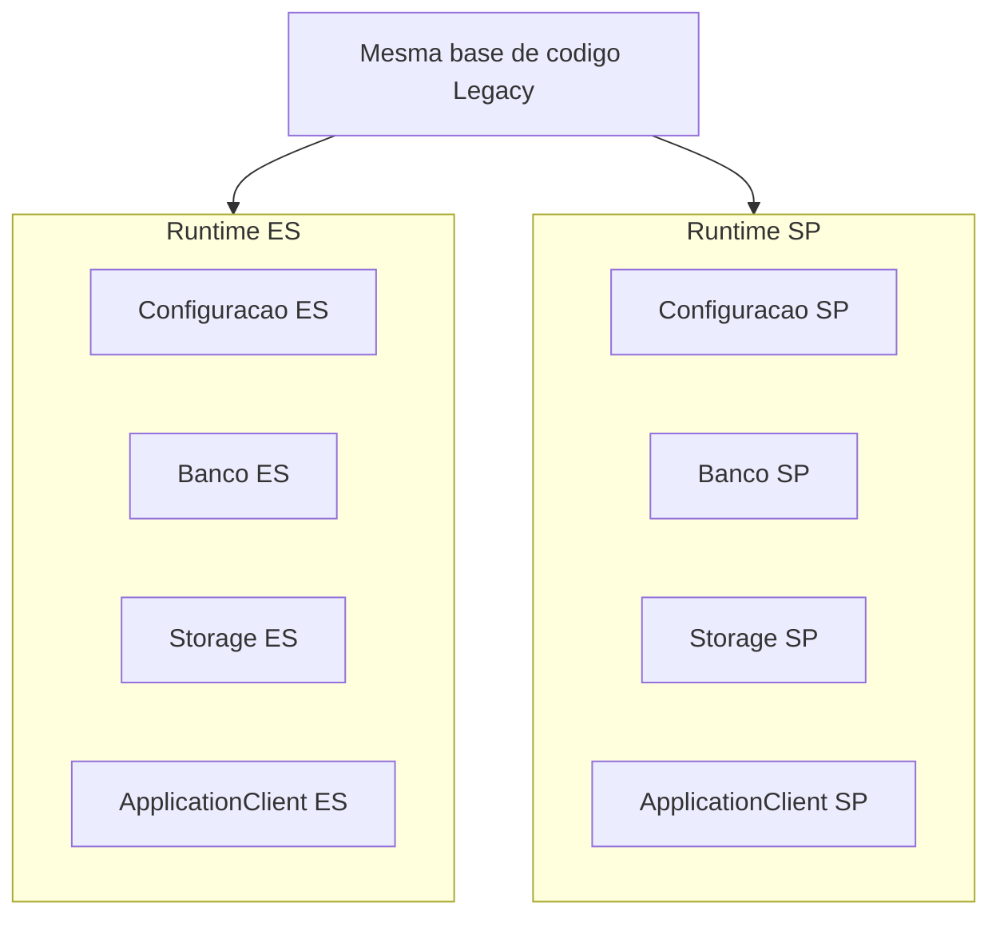
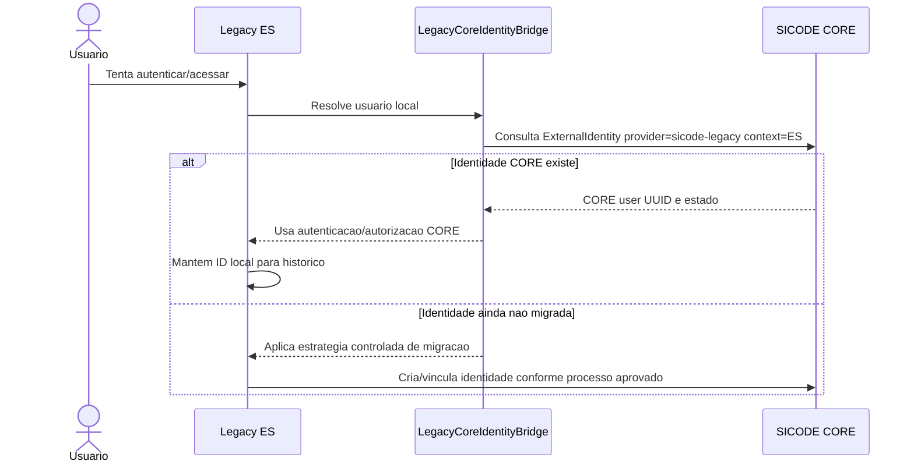

# Integracao entre SICODE Legacy e SICODE CORE

Este documento define a estrategia de compatibilidade entre o CORE e os ambientes Legacy ES e Legacy SP.

## Premissas

O Legacy e fonte de requisitos, regras existentes e dados historicos. Ele nao e o modelo canonico do novo ecossistema.

OBRIGATORIO: preservar IDs historicos e foreign keys existentes no Legacy.

PROIBIDO: reconstruir todo o banco Legacy como condicao para migracao.

PROIBIDO: remapear cegamente foreign keys historicas para IDs CORE.

## Segregacao ES e SP

Legacy ES e Legacy SP sao contextos de dados independentes.

Mesmo quando compartilharem codigo, devem possuir:

- runtime/configuracao propria;
- banco proprio;
- storage proprio;
- cliente de autenticacao proprio;
- autorizacoes independentes no CORE.



OBRIGATORIO: usuario pode ter acesso ao ES sem acesso ao SP, e vice-versa.

## Ponte de identidade

Nome canonico proposto: `LegacyCoreIdentityBridge`.

Responsabilidades:

- resolver usuario Legacy para usuario CORE;
- registrar e consultar ExternalIdentity;
- autenticar pelo CORE quando disponivel;
- manter compatibilidade com referencias locais;
- impedir que senha Legacy continue sendo autoridade apos migracao;
- expor uma interface removivel para aposentadoria futura do Legacy.

PROIBIDO: a ponte virar dependencia estrutural do CORE.

PROIBIDO: o CORE conhecer tabelas internas Legacy como parte do seu modelo canonico.

## Fluxo Legacy ES para CORE



## Migracao progressiva

Fases recomendadas:

1. Inventariar usuarios Legacy e chaves locais por ambiente.
2. Criar identidades CORE para usuarios elegiveis.
3. Criar ExternalIdentity por ambiente: ES e SP separadamente.
4. Adicionar `core_user_id` como projecao local onde tecnicamente aprovado.
5. Fazer novos logins preferirem CORE para usuarios migrados.
6. Desativar dependencia de senha Legacy para usuarios migrados.
7. Remover ponte quando Legacy for aposentado.

Nao implementar estas fases sem plano tecnico e migrations aprovadas.

## Projecao local no Legacy

PERMITIDO: Legacy manter usuario local com ID historico.

RECOMENDADO: adicionar referencia local `core_user_id` somente apos ADR ou tarefa tecnica especifica de migracao.

O Legacy pode projetar:

- `core_user_id`;
- nome;
- email;
- estado resumido;
- data da ultima sincronizacao.

O CORE permanece autoridade por identidade global.

## Senhas e autenticacao Legacy

Para usuarios migrados:

- RECOMENDADO: autenticacao deve ocorrer pelo CORE;
- PROIBIDO: senha Legacy continuar sendo autoridade primaria indefinidamente;
- PERMITIDO: coexistencia temporaria durante migracao controlada, com prazo e criterio documentados.

Para usuarios nao migrados:

- PERMITIDO: fluxo Legacy existente durante transicao;
- OBRIGATORIO: registrar caminho de migracao para identidade CORE.

## Lancamento CORE para Legacy Laravel 10

O protocolo arquitetural de lancamento CORE -> Legacy esta definido em `docs/decisions/ADR-002-core-launch-protocol-and-legacy-consumer.md`.

Fluxo normativo:

```text
CORE Hub
-> launch authorization
-> legacy callback
-> backend exchange
-> resolve CORE subject
-> link to legacy user
-> Laravel 10 session
-> session regeneration
-> internal SICODE route
-> normal Blade/Livewire 2 operation
```

O Legacy deve receber o callback HTTP, validar parametros tecnicos, trocar o codigo com o CORE por backend-to-backend, resolver `core_subject` para usuario local, resolver `core_organization_id` para empresa local, estabelecer sua propria sessao Laravel 10, regenerar a sessao e redirecionar somente para rota interna segura.

Livewire 2 nao deve participar do protocolo de autenticacao ou lancamento. Depois da sessao local estabelecida, Blade e Livewire continuam operando pelo usuario local autenticado.

O Legacy deve isolar essa compatibilidade em uma camada anticorrupcao propria, conceitualmente `app/CoreIntegration`, responsavel por client HTTP, DTOs, consumo de codigo, resolucao de vinculo, estabelecimento de sessao, erros de integracao e auditoria local. Controllers e componentes Livewire nao devem parsear payload CORE diretamente.

O vinculo local entre `core_subject` e usuario Legacy deve ser tratado como estrutura local do Legacy, com unicidade por runtime/contexto ES/SP e sem usar email ou ID local Legacy como identidade global.

O vinculo local entre organizacao CORE e empresa Legacy deve ser tratado por estrutura separada, conceitualmente `core_organization_links`:

```text
CORE organization
-> core_organization_links
-> companies.id local
-> contexto empresarial efetivo do Legacy
```

`core_identity_links` e `core_organization_links` possuem responsabilidades distintas. O usuario estar vinculado ao CORE nao implica que a organizacao autorizada esteja vinculada a uma empresa local.

`users.company_id`, `company_user` e `employees -> contracts` permanecem estruturas Legacy. Elas nao devem ser usadas para inferir silenciosamente a organizacao CORE nem como fallback quando `core_organization_links` estiver ausente.

Depois da autenticacao e resolucao organizacional, o Legacy deve materializar uma abstracao local de contexto empresarial, como `CurrentCompanyContext`. Controllers, services e componentes Livewire 2 devem consumir essa abstracao para obter a empresa autorizada do fluxo atual, sem interpretar payload CORE diretamente nem espalhar acesso cru a sessao.

Quando `users.company_id` apontar para empresa diferente daquela autorizada pelo launch CORE, o Legacy deve tratar a divergencia explicitamente. A politica segura inicial e rejeitar o lancamento, sem alterar `users.company_id` e sem autenticar silenciosamente em empresa divergente. Uma politica de atuacao contextual sem mudar a empresa principal exige decisao administrativa/documental posterior.

### Contexto empresarial local

`CurrentCompanyContext` encapsula as chaves de sessao usadas pela integracao e expoe apenas operacoes de dominio:

- `isEstablished()`;
- `requireEstablished()`;
- `companyId()`;
- `company()` / `requireCompany()`;
- `coreOrganizationId()`;
- `applicationContext()`;
- `source()`;
- `clear()`.

Origens permitidas:

- `core`: materializada exclusivamente de `core_organization_links` apos exchange backend-to-backend;
- `legacy`: compatibilidade temporaria do login local, materializada a partir de `users.company_id`.

O contexto de origem `legacy` nao cria vinculos CORE e nao deve ser usado como fallback quando o fluxo entrou pelo CORE. O logout local deve limpar explicitamente o contexto, e uma nova autenticacao deve sobrescrever qualquer contexto anterior.

Rotas que dependem obrigatoriamente de empresa ativa podem usar o middleware `current.company`. Ele nao e global e nao deve ser aplicado a login, logout, callback CORE, rotas publicas, reconciliacao, administracao multempresa ou consultas historicas sem escopo empresarial unico.

### Testes sobre dump restaurado

A base `sicode_legacy` restaurada e considerada base oficial de integracao com dados representativos. Testes CORE -> Legacy sobre essa base nao podem usar `RefreshDatabase`, `DatabaseMigrations`, truncates globais, `migrate:fresh`, `db:wipe`, drops ou seeds destrutivos.

O padrao aprovado para o consumidor CORE e:

- `LEGACY_TEST_DATABASE_ALLOWED=true` explicito no comando;
- allowlist de conexao, host e nome de banco;
- `DatabaseTransactions` para rollback por teste;
- fixtures com prefixo `TEST_CORE_LAUNCH_` e UUIDs randomicos;
- verificacao objetiva de contagens antes/depois.

O inventario semantico inicial de `company_id` esta registrado em `docs/inventory/legacy/company-id-semantic-inventory-2026-07-20.md`.

## Aposentadoria do Legacy

A camada `LegacyCoreIdentityBridge` deve ser removivel sem alterar o modelo canonico do CORE.

Quando o Legacy for aposentado:

- ExternalIdentity pode permanecer para auditoria e rastreabilidade;
- projecoes locais Legacy deixam de ser dependencias vivas;
- SICODE 2.0 continua consumindo CORE diretamente.

## Conflitos e riscos conhecidos

- O Legacy possui ao menos tres modelos de vinculo empresarial sem sincronizacao global garantida.
- `users.company_id`, `company_user` e `employees -> contracts` nao devem ser promovidos a modelo CORE.
- IDs locais podem colidir entre ES e SP.
- O repositorio atual nao contem inventario, migrations ou Models para validacao de conflitos adicionais.
