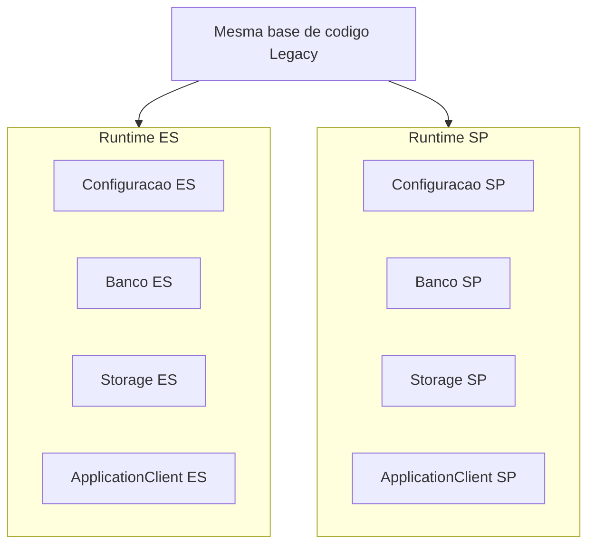
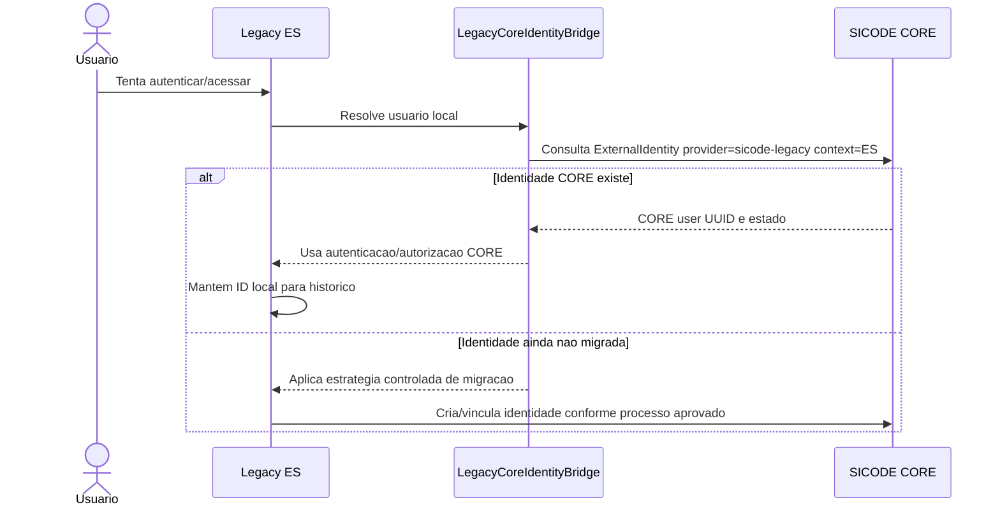

# Integracao entre SICODE Legacy e SICODE CORE

Este documento define a estrategia de compatibilidade entre o CORE e os ambientes Legacy ES e Legacy SP.

## Premissas

O Legacy e fonte de requisitos, regras existentes e dados historicos. Ele nao e o modelo canonico do novo ecossistema.

OBRIGATORIO: preservar IDs historicos e foreign keys existentes no Legacy.

PROIBIDO: reconstruir todo o banco Legacy como condicao para migracao.

PROIBIDO: remapear cegamente foreign keys historicas para IDs CORE.

## Segregacao ES e SP

Legacy ES e Legacy SP sao contextos de dados independentes.

Mesmo quando compartilharem codigo, devem possuir:

- runtime/configuracao propria;
- banco proprio;
- storage proprio;
- cliente de autenticacao proprio;
- autorizacoes independentes no CORE.

OBRIGATORIO: usuario pode ter acesso ao ES sem acesso ao SP, e vice-versa.

## Ponte de identidade

Nome canonico proposto: `LegacyCoreIdentityBridge`.

Responsabilidades:

- resolver usuario Legacy para usuario CORE;
- registrar e consultar ExternalIdentity;
- autenticar pelo CORE quando disponivel;
- manter compatibilidade com referencias locais;
- impedir que senha Legacy continue sendo autoridade apos migracao;
- expor uma interface removivel para aposentadoria futura do Legacy.

PROIBIDO: a ponte virar dependencia estrutural do CORE.

PROIBIDO: o CORE conhecer tabelas internas Legacy como parte do seu modelo canonico.

## Fluxo Legacy ES para CORE

## Migracao progressiva

Fases recomendadas:

1. Inventariar usuarios Legacy e chaves locais por ambiente.
2. Criar identidades CORE para usuarios elegiveis.
3. Criar ExternalIdentity por ambiente: ES e SP separadamente.
4. Adicionar `core_user_id` como projecao local onde tecnicamente aprovado.
5. Fazer novos logins preferirem CORE para usuarios migrados.
6. Desativar dependencia de senha Legacy para usuarios migrados.
7. Remover ponte quando Legacy for aposentado.

Nao implementar estas fases sem plano tecnico e migrations aprovadas.

## Projecao local no Legacy

PERMITIDO: Legacy manter usuario local com ID historico.

RECOMENDADO: adicionar referencia local `core_user_id` somente apos ADR ou tarefa tecnica especifica de migracao.

O Legacy pode projetar:

- `core_user_id`;
- nome;
- email;
- estado resumido;
- data da ultima sincronizacao.

O CORE permanece autoridade por identidade global.

## Senhas e autenticacao Legacy

Para usuarios migrados:

- RECOMENDADO: autenticacao deve ocorrer pelo CORE;
- PROIBIDO: senha Legacy continuar sendo autoridade primaria indefinidamente;
- PERMITIDO: coexistencia temporaria durante migracao controlada, com prazo e criterio documentados.

Para usuarios nao migrados:

- PERMITIDO: fluxo Legacy existente durante transicao;
- OBRIGATORIO: registrar caminho de migracao para identidade CORE.

## Aposentadoria do Legacy

A camada `LegacyCoreIdentityBridge` deve ser removivel sem alterar o modelo canonico do CORE.

Quando o Legacy for aposentado:

- ExternalIdentity pode permanecer para auditoria e rastreabilidade;
- projecoes locais Legacy deixam de ser dependencias vivas;
- SICODE 2.0 continua consumindo CORE diretamente.

## Conflitos e riscos conhecidos

- O Legacy possui ao menos tres modelos de vinculo empresarial sem sincronizacao global garantida.
- `users.company_id`, `company_user` e `employees -> contracts` nao devem ser promovidos a modelo CORE.
- IDs locais podem colidir entre ES e SP.
- O repositorio atual nao contem inventario, migrations ou Models para validacao de conflitos adicionais.

