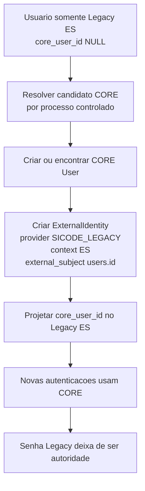
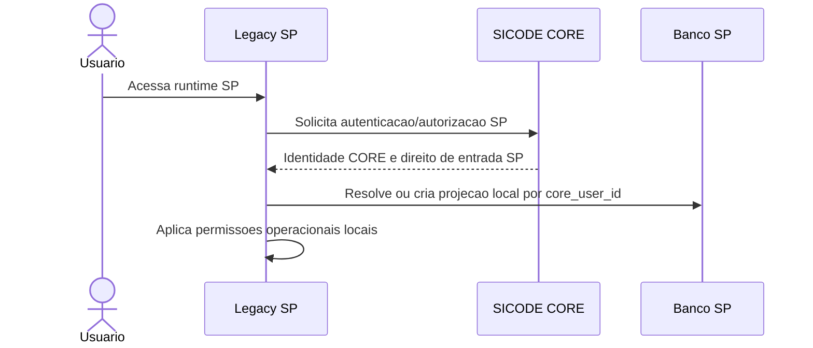

# Mapa normativo de transicao Legacy -> CORE

Este documento confronta a evidencia tecnica do SICODE Legacy com o modelo canonico do SICODE CORE e define o mapa formal de transicao. Ele e normativo para qualquer implementacao futura de compatibilidade Legacy.

## 1. Objetivo

Definir como conceitos reais do SICODE Legacy devem ser relacionados ao CORE sem reproduzir no CORE as limitacoes historicas do Legacy.

Este mapa prepara a modelagem fisica futura. Ele nao cria tabelas, migrations, Models, autenticao, endpoints, sincronizacao ou importacao.

## 2. Escopo

Inclui:

- identidade local Legacy;
- autenticacao Legacy;
- vinculos usuario/empresa/contrato;
- autorizacao local Legacy;
- projecao local de usuario;
- estrategia Legacy ES;
- estrategia Legacy SP;
- impactos para SICODESK e SICODE 2.0.

Exclui:

- implementacao OAuth/OIDC;
- migrations;
- alteracoes em Models;
- importacao de usuarios;
- alteracao funcional do Legacy;
- desenho fisico definitivo do banco CORE.

## 3. Fontes tecnicas

Fontes normativas:

- `docs/architecture/core-identity-access-canon.md`
- `docs/architecture/core-identity-domain-model.md`
- `docs/architecture/core-application-authorization-boundaries.md`
- `docs/architecture/legacy-core-integration.md`
- `docs/decisions/ADR-001-core-identity-authority-and-legacy-transition.md`

Fonte factual Legacy:

- `docs/inventory/legacy/legacy-identity-company-contract-authorization-inventory.md`

O inventario Legacy descreve o estado existente. Ele nao define arquitetura canonica.

## 4. Principios de transicao

OBRIGATORIO: o CORE permanece autoridade canonica de identidade, autenticacao futura e direito de entrada.

OBRIGATORIO: o Legacy continua funcionando durante a transicao sem remapear foreign keys historicas.

OBRIGATORIO: `users.id` Legacy permanece identificador local e historico.

PROIBIDO: usar `users.id`, mesmo sendo UUID, como `CORE User.id`.

OBRIGATORIO: a relacao entre usuario Legacy e usuario CORE deve ocorrer por `ExternalIdentity` e, quando aprovado fisicamente, por projecao local `core_user_id`.

OBRIGATORIO: ES e SP sao contextos independentes. IDs iguais em bancos diferentes nao devem colidir.

PROIBIDO: mapear tabelas por semelhanca de nome. Todo mapeamento deve ser semantico.

PROIBIDO: transformar permissoes operacionais Legacy em permissoes CORE.

## 5. Evidencia Legacy versus modelo canonico

O inventario mostra que o Legacy possui:

- `users.id` UUID como identidade local e alvo de muitas dependencias de dominio;
- login web e API por `email` e `password`;
- guard `web`, provider Eloquent `App\Models\User` e tokens Sanctum na API;
- ausencia de status ativo/inativo, usando soft delete como bloqueio pratico;
- flags booleanas em `users`, Gates, Policies, middleware por service e regras inline;
- `superadm` com bypass recorrente;
- tres formas coexistentes de vinculo organizacional/operacional: `users.company_id`, `company_user` e `employees -> contracts`;
- `contracts` Legacy com `company_id`, `number`, `date_end`, booleanos `service`/`construction`, sem `date_start`, status ou vigencia executavel global;
- `services` como atividade, modulo, rota, capacidade individual e escopo contratual.

O modelo canonico CORE exige:

- `User` global independente de aplicacao;
- `Organization` como entidade institucional;
- `OrganizationMembership` historico;
- `Contract` institucional com ciclo de vida;
- `Application`, `ApplicationClient` e `ApplicationContext`;
- `ApplicationAccess` como direito de entrada;
- autorizacao operacional local nas aplicacoes.

## 6. Mapa de identidade

### Separacao conceitual de `users`

```text
Legacy User
    |
    +-- Identity attributes
    |       id, name, email, Registration, avatar
    |
    +-- Authentication attributes
    |       password, remember_token, first_pass
    |
    +-- Organizational attributes
    |       company_id, company_user, employees.contract_id
    |
    +-- Local authorization attributes
    |       superadm, admin, management, operator, user, contract,
    |       bypassprod, engineer, btzero, analyst, responsible,
    |       can_dispatch, legal_controller, legal_field, legal_manager,
    |       permission_locks, service_users
    |
    +-- Operational attributes
            manager_id, onlyparner, soft delete, timestamps,
            referencias de autoria, execucao, aprovacao e auditoria
```

Destino:

- `users.id`: `TRANSITION COMPATIBILITY`; preservado como ID local e `ExternalIdentity.external_subject`.
- `users.name`: `LOCAL PROJECTION`; CORE deve ser autoridade pelo nome canonico quando o usuario estiver migrado.
- `users.email`: `LOCAL PROJECTION`; CORE deve ser autoridade pelo email principal quando o usuario estiver migrado.
- `users.password`: `DEPRECATED`; deixa de ser autoridade para usuarios migrados.
- flags e permissions locais: `APPLICATION LOCAL`; permanecem no Legacy enquanto ele existir.
- referencias operacionais por `users.id`: `TRANSITION COMPATIBILITY`; nao devem ser remapeadas para CORE.

### Contrato futuro de `core_user_id` local

Quando aprovado por tarefa fisica futura, o Legacy pode receber uma referencia local:

- finalidade: acelerar resolucao local para a identidade canonica e permitir associar sessoes CORE ao usuario Legacy preservando `users.id`;
- tipo recomendado: UUID compativel com `CORE User.id`;
- nulabilidade: nullable durante toda a migracao;
- unicidade: unique por banco Legacy quando cada registro local representar uma unica identidade CORE;
- indexacao: indice para login, sincronizacao e auditoria;
- comportamento para nao migrados: `core_user_id IS NULL` significa usuario ainda nao vinculado ao CORE;
- flags redundantes proibidas: `is_migrated`, `core_migrated`, `migration_completed`, `uses_core`, salvo ADR que prove necessidade operacional.

`core_user_id` nao substitui `ExternalIdentity`. Ele e uma projecao local e pode ser reconstruido a partir da relacao canonica.

## 7. Identidades externas

O modelo canonico e suficiente para ES/SP desde que a chave logica seja:

```text
provider + provider_context + external_subject
```

Exemplos:

```text
provider = SICODE_LEGACY
provider_context = ES
external_subject = 152
```

```text
provider = SICODE_LEGACY
provider_context = SP
external_subject = 152
```

Esses dois registros nao colidem e nao significam automaticamente a mesma pessoa.

Restricoes obrigatorias futuras:

- unique em `provider + provider_context + external_subject`;
- unique opcional controlada em `provider + provider_context + user_id` quando a politica do provider permitir apenas uma identidade externa por contexto;
- historico/rastreabilidade de `linked_at`, origem da migracao, usuario/processo responsavel e estado;
- proibicao de vincular uma identidade externa ativa a mais de um `CORE User`.

Prevenir multiplos vinculos acidentais exige processo de resolucao de duplicidade antes de ativar o vinculo.

## 8. Modelo organizacional

### `users.company_id`

Evidencia:

- FK nullable para `companies.id`;
- cardinalidade zero ou uma empresa direta;
- usado como filtro operacional;
- relacao `withTrashed`;
- nao possui historico;
- nao sincroniza automaticamente com `company_user` ou `employees`;
- login nao exige empresa.

Classificacao:

- significado operacional: empresa direta/corrente usada por fluxos Legacy;
- destino: `TRANSITION COMPATIBILITY` e, quando migrado, possivel `LOCAL PROJECTION`;
- nao e equivalente direto a `OrganizationMembership`.

O CORE evita reproduzir `users.company_id` porque o vinculo canonico e temporal, N:N, historico e independente da identidade. `OrganizationMembership` deve registrar inicio, fim, estado e principalidade por contexto, enquanto `users.company_id` sobrescreve estado corrente sem historico.

### `company_user`

Evidencia:

- pivot N:N entre usuario e empresa;
- sem unique composto no schema;
- admite multiplas empresas e duplicatas tecnicas;
- usado junto de filtros/escopos operacionais;
- nao sincroniza automaticamente com `users.company_id`.

Classificacao:

- pode representar empresas visiveis, administraveis ou escopo operacional local;
- pode se sobrepor parcialmente a vinculo organizacional;
- destino: `APPLICATION LOCAL` para escopo operacional Legacy e `TRANSITION COMPATIBILITY` durante migracao;
- nao deve ser transformado automaticamente em `OrganizationMembership`.

Responsabilidades CORE:

- membership institucional canonico quando a relacao for comprovadamente vinculo entre pessoa e organizacao.

Responsabilidades Legacy:

- visibilidade operacional;
- administracao local;
- filtros de tela;
- regras de acesso a dados Legacy.

### `employees -> contracts`

Evidencia:

- `employees` liga `user_id`, `contract_id` e `service_id`;
- `User::Employee` e `hasOne`, mas banco permite mais de uma linha;
- criado/atualizado por manutencoes de usuario;
- relaciona usuario a contrato e service;
- nao ha historico robusto nem garantia global de unicidade;
- nao ha validacao global de vigencia contratual.

Significado:

- `employee` representa vinculo operacional Legacy entre usuario local, contrato Legacy e service;
- pode corresponder a um `CORE User` quando houver login humano, mas nao deve ser assumido como identidade;
- pode representar pessoa com login e vinculo operacional; a evidencia nao prova employee sem login porque ha `user_id`;
- `contract` Legacy pertence a uma `company`, mas seu ciclo de vida e regras nao equivalem ao contrato institucional CORE.

Classificacao de `contracts` Legacy versus `CORE Contract`: PARCIALMENTE RELACIONADO.

Justificativa: ambos relacionam organizacao/empresa a capacidade institucional, mas o contrato Legacy nao possui inicio, status, suspensao, encerramento formal ou efeito global de autorizacao por vigencia. Ele tambem participa de service e employee como regra operacional Legacy.

## 9. Contratos

O CORE Contract deve representar vinculo institucional com ciclo de vida e efeito sobre acesso a aplicacoes/contextos.

O Legacy `contracts` representa atualmente:

- vinculo com `companies`;
- numero textual sem unique;
- data final sem efeito automatico comprovado;
- booleanos `service` e `construction`;
- relacao com `services` via `service_contract_rules`;
- base para `employees`.

Destino:

- contratos Legacy podem alimentar candidatos a `CORE Contract` somente apos classificacao semantica e saneamento;
- `service_contract_rules` permanece `APPLICATION LOCAL` para regras operacionais Legacy;
- `date_end` Legacy nao deve ser promovido automaticamente a encerramento canonico sem validacao de negocio.

## 10. Autenticacao

### Estado atual: Legacy Authentication Authority

O Legacy autentica por:

- web: `Auth::attempt` com `email` e `password`;
- guard `web`, sessao, provider Eloquent `App\Models\User`;
- API: email/senha e token Sanctum;
- senha Laravel hashed;
- `remember_token`;
- `first_pass` para troca obrigatoria, com rota efetiva ambigua no inventario;
- soft delete como bloqueio pratico;
- middleware `Authenticate`;
- Gates com bypass `superadm`;
- possivel divergencia em password reset (`password_resets` versus `password_reset_tokens`).

### Estado destino: CORE Authentication Authority

Para usuarios migrados:

- CORE autentica;
- `CORE User.id` e o `subject` estavel;
- Legacy recebe token/sessao validada por contrato;
- senha Legacy deixa de ser autoridade;
- soft delete Legacy nao pode contradizer bloqueio global CORE, mas pode preservar bloqueio local.

Deve desaparecer progressivamente:

- senha Legacy como autoridade primaria;
- senha inicial hardcoded `123456`;
- reset administrativo baseado apenas no banco Legacy;
- `first_pass` como regra global de autenticacao;
- tokens Sanctum Legacy como autenticacao ecossistemica.

Permanece temporariamente no Legacy ES:

- login Legacy para usuarios ainda nao migrados;
- `users.id` para referencias historicas;
- flags/Gates locais para autorizacao operacional;
- sessao local enquanto a aplicacao nao estiver totalmente integrada ao CORE.

## 11. Autorizacao

### CORE

Pertence ao CORE:

- direito de entrar no SICODE Legacy ES;
- direito de entrar no SICODE Legacy SP;
- direito de entrar no SICODESK;
- estado global da identidade;
- restricao institucional global;
- acesso a aplicacao, cliente e contexto;
- relacao com organizacao e contrato institucional quando aplicavel.

### LEGACY LOCAL

Permanecem no Legacy:

- `superadm`, `admin`, `management`, `engineer`, `responsible`, `analyst`;
- `operator`, `user`, `btzero`;
- `contract` como flag de escopo Legacy;
- `bypassprod`;
- `can_dispatch`;
- `legal_controller`, `legal_field`, `legal_manager`;
- `permission_locks`;
- `service_users.service`;
- `service_users.dispatch`;
- Policies de cancelamento;
- regras inline de producao, viabilidade, despacho, juridico, retorno, relatorios e workflow;
- `onlyparner` enquanto restricao de navegacao local.

### AMBIGUO

- `contract` flag em `users`: evidencia mostra uso como escopo de dados e relatorios, nao como contrato institucional CORE. Deve ser tratada como Legacy local ate auditoria de cada fluxo.
- `can_dispatch` versus `service_users.dispatch`: evidencia prova coexistencia, mas nao define se devem ser cumulativos ou alternativos. Exige analise de negocio antes de saneamento.
- `operator` e `user`: evidencia mostra uso em menu/rotas, mas protecao backend nao e uniforme. Exige auditoria de acoes sensiveis.
- `onlyparner`: restringe navegacao local; nao ha evidencia suficiente para decidir se vira contexto CORE, regra Legacy ou politica de uma aplicacao parceira.

## 12. Legacy ES

Legacy ES e uma transicao.

Fluxo formal:



Condicao inicial:

- usuario existe apenas em `users` Legacy ES;
- `core_user_id` ausente ou nulo;
- autenticacao Legacy ainda permitida.

Evento de vinculo:

- identidade CORE criada ou encontrada;
- `ExternalIdentity` criada com contexto ES;
- projecao local preenchida quando coluna existir;
- duplicidades resolvidas antes da ativacao.

Resolucao de duplicidade:

- email igual nao e prova suficiente isolada;
- `Registration` nao e autenticador e nao e unique;
- empresa/endereco nao provam origem ES/SP;
- decisoes automaticas devem ser conservadoras e auditaveis.

Comportamento apos vinculo:

- CORE autentica;
- Legacy preserva `users.id`;
- flags e escopos locais continuam decidindo regras operacionais;
- senha Legacy nao deve ser atualizada como segredo primario.

Fallback temporario:

- permitido apenas para usuarios ainda nao migrados;
- para migrados, indisponibilidade do CORE deve usar sessao/token previamente validado dentro de politica aprovada ou falhar de modo controlado;
- proibido recriar autenticacao paralela permanente.

## 13. Legacy SP

Legacy SP e CORE-first bootstrap.

SP deve nascer com:

- runtime proprio;
- `.env` proprio;
- banco proprio;
- storage proprio;
- `ApplicationClient` proprio;
- `ApplicationContext = SP`;
- autorizacao de entrada propria no CORE.

Fluxo formal:



Fluxos Legacy que nao devem ser usados para novos usuarios SP:

- criacao de senha local `123456` como autoridade primaria;
- login independente por email/senha local;
- inferir origem por `company_id`, `Registration`, `uf` ou `regional`;
- migracao ES como se SP fosse copia de dados ES.

SP pode criar projecao local minima:

- `core_user_id`;
- nome;
- email;
- status global resumido;
- timestamps de sincronizacao;
- ID local necessario para FKs internas.

## 14. Projecao local

Projecao local e a representacao, em uma aplicacao consumidora, de dados cuja autoridade pertence a outro dominio.

OBRIGATORIO: projecao local nao cria autoridade concorrente.

OBRIGATORIO: a direcao de sincronizacao deve ser explicita.

PROIBIDO: sincronizacao bidirecional silenciosa.

| Atributo | Autoridade | Legacy ES | Legacy SP | SICODESK | Estrategia |
| --- | --- | --- | --- | --- | --- |
| `core_user_id` | CORE AUTHORITATIVE | LOCAL PROJECTION nullable durante migracao | LOCAL PROJECTION obrigatoria para novos usuarios | LOCAL PROJECTION | CORE -> aplicacao; reconstruivel por ExternalIdentity quando aplicavel |
| nome | CORE AUTHORITATIVE para migrados | LOCAL PROJECTION | LOCAL PROJECTION | LOCAL PROJECTION | CORE -> aplicacao; alteracoes locais nao retornam sem contrato |
| e-mail | CORE AUTHORITATIVE para migrados | LOCAL PROJECTION | LOCAL PROJECTION | LOCAL PROJECTION | CORE -> aplicacao; usado localmente apenas como exibicao/contato |
| status global | CORE AUTHORITATIVE | DERIVED | DERIVED | DERIVED | CORE -> aplicacao; bloqueio global impede novas entradas |
| organization | CORE AUTHORITATIVE quando institucional | TRANSITION ONLY/LOCAL PROJECTION | LOCAL PROJECTION quando necessario | LOCAL PROJECTION quando necessario | CORE -> aplicacao; empresas Legacy nao migram automaticamente |
| organization membership | CORE AUTHORITATIVE | TRANSITION ONLY | LOCAL PROJECTION quando necessario | LOCAL PROJECTION quando necessario | CORE -> aplicacao; exige criterio institucional |
| application access | CORE AUTHORITATIVE | DERIVED na entrada ES | DERIVED na entrada SP | DERIVED na entrada SICODESK | CORE decide entrada; aplicacao nao sobrescreve |
| permissoes operacionais | APPLICATION AUTHORITATIVE | APPLICATION LOCAL | APPLICATION LOCAL | APPLICATION LOCAL | Aplicacao local; nao sobe ao CORE |
| senha | CORE AUTHORITATIVE para migrados; TRANSITION ONLY para nao migrados ES | TRANSITION ONLY | DEPRECATED para novos usuarios | nao aplicavel como autoridade ecossistemica | ES temporario; SP/SICODESK via CORE |

## 15. SICODESK

As decisoes para o Legacy nao criam dependencias Legacy para o SICODESK.

SICODESK deve conhecer:

- `CORE User.id`;
- claims/contratos externos do CORE;
- direito de entrada na aplicacao;
- dados projetados minimos.

SICODESK nao deve conhecer:

- `legacy_user_id`;
- `users.company_id`;
- `company_user`;
- `employees`;
- `contracts` Legacy;
- `service_users`;
- flags Legacy.

Permissoes como operador, equipe, gestor, administrador, SLA e base de conhecimento sao `APPLICATION LOCAL`.

## 16. Preparacao para SICODE 2.0

O SICODE 2.0 deve consumir:

- `CORE User`;
- `Organization`;
- `OrganizationMembership`;
- `Contract`;
- `ApplicationAccess`;
- `ApplicationContext`;
- contratos externos de autenticacao/autorizacao do CORE.

Nao deve consumir:

- `LegacyCoreIdentityBridge`;
- `ExternalIdentity` Legacy como dependencia operacional;
- IDs locais Legacy;
- estrutura `users.company_id`;
- `company_user`;
- `employees -> contracts`;
- flags Legacy.

Teste arquitetural: se Legacy ES e SP forem desligados, o modelo CORE permanece coerente para SICODESK e SICODE 2.0 porque a bridge e as projecoes Legacy sao camadas removiveis, nao conceitos canonicos.

## 17. Matriz de transicao

| Conceito Legacy | Significado real | Autoridade atual | Destino canonico | Estrategia |
| --- | --- | --- | --- | --- |
| `users` | usuario local, autenticavel e fortemente acoplado ao dominio | Legacy | CORE User + projecao local | Criar/relacionar CORE User via ExternalIdentity; preservar `users.id` |
| `users.id` | UUID local e FK historica | Legacy | ExternalIdentity.external_subject | TRANSITION COMPATIBILITY; nunca PK global CORE |
| `password` | segredo local Laravel | Legacy | credencial CORE futura | DEPRECATED para migrados; temporario no ES |
| `remember_token` | remember-me local | Legacy | sem equivalente canonico obrigatorio | APPLICATION LOCAL/DEPRECATED |
| `first_pass` | troca de senha local | Legacy | politica CORE futura | DEPRECATED; nao virar regra CORE |
| `users.deleted_at` | soft delete e bloqueio pratico | Legacy | CORE User.status | Projetar status global; preservar soft delete local |
| `name` | nome exibido/editavel localmente | Legacy | CORE User.display_name | LOCAL PROJECTION para migrados |
| `email` | login e contato local | Legacy | CORE User.primary_email | LOCAL PROJECTION para migrados |
| `Registration` | matricula/cadastro textual, nao autenticador | Legacy | atributo externo opcional/metadado | APPLICATION LOCAL ou metadado auditado |
| `users.company_id` | empresa direta/corrente usada em filtros | Legacy | OrganizationMembership somente se comprovado | TRANSITION COMPATIBILITY/LOCAL PROJECTION; nao mapear direto |
| `company_user` | empresas visiveis/administraveis/escopo N:N | Legacy | possivel membership ou escopo local | APPLICATION LOCAL; migrar seletivamente |
| `companies` | empresa Legacy com dados cadastrais e soft delete | Legacy | Organization candidata | CORE CANONICAL somente se passar criterio institucional |
| `employees` | vinculo usuario-contrato-service | Legacy | sem equivalente direto | APPLICATION LOCAL/TRANSITION COMPATIBILITY |
| `contracts` | contrato Legacy empresa-service com `date_end` limitado | Legacy | CORE Contract parcialmente relacionado | Migrar apenas contratos institucionais saneados |
| `service_contract_rules` | contrato-service e parametros operacionais | Legacy | ContractApplicationGrant apenas se for direito institucional | APPLICATION LOCAL por padrao |
| `services` | atividade, modulo, rota, capacidade e escopo | Legacy | Application/Context apenas para entrada; dominio local para atividade | Separar catalogo de aplicacao de atividade operacional |
| `service_users` | capacidade individual por service/dispatch | Legacy | permissao operacional local | APPLICATION LOCAL |
| `superadm` | bypass local amplo | Legacy | sem equivalente automatico | APPLICATION LOCAL; acesso CORE admin exige decisao propria |
| `admin`, `management`, `engineer`, `responsible`, `analyst` | papeis/flags operacionais | Legacy | sem equivalente CORE | APPLICATION LOCAL |
| `operator`, `user`, `btzero` | flags de menu/operacao | Legacy | sem equivalente CORE | APPLICATION LOCAL |
| `contract` flag | escopo local ligado a dados/relatorios | Legacy | ambiguo, nao CORE Contract | APPLICATION LOCAL ate auditoria |
| `bypassprod` | bypass de producao | Legacy | sem equivalente CORE | APPLICATION LOCAL |
| `can_dispatch` | permissao global local de despacho | Legacy | sem equivalente CORE | APPLICATION LOCAL |
| `legal_*` flags | papeis juridicos locais | Legacy | sem equivalente CORE | APPLICATION LOCAL |
| `permission_locks` | bloqueios locais por flag | Legacy | sem equivalente CORE | APPLICATION LOCAL |
| Policies de cancelamento | autorizacao por recurso local | Legacy | sem equivalente CORE | APPLICATION LOCAL |
| `onlyparner` | restricao local de navegacao | Legacy | UNRESOLVED | Auditar regra de negocio antes de decidir |
| Sanctum API tokens | token local Legacy | Legacy | tokens CORE futuros | DEPRECATED para integracao ecossistemica |

## 18. Conceitos descontinuados

Devem desaparecer progressivamente como autoridade ecossistemica:

- senha Legacy para usuarios migrados;
- criacao/reset com senha fixa `123456`;
- tokens Sanctum Legacy como autenticacao entre aplicacoes do ecossistema;
- `first_pass` como politica global;
- inferencia de identidade por email Legacy isolado;
- inferencia de organizacao canonica por `users.company_id`;
- inferencia de contrato canonico por nome da tabela `contracts`.

## 19. Riscos tecnicos

- `users.id` e usado por muitas tabelas, algumas sem FK fisica uniforme; remapeamento direto quebraria historico.
- `company_user`, `employees` e `service_contract_rules` permitem duplicidades ou divergencias tecnicas.
- `contracts.date_end` nao aplica expiracao global no codigo observado; migrar como vigencia efetiva pode alterar comportamento.
- `services` mistura conceitos de atividade, modulo, rota e capacidade.
- `superadm` bypass e autorizacoes inline podem mascarar regras nao documentadas.
- `first_pass` e reset de senha possuem ambiguidades de rota/implementacao.
- Nao ha dados operacionais neste repositorio para medir inconsistencias reais.

## 20. Invariantes adicionais

OBRIGATORIO: `ExternalIdentity` deve ser criada antes de qualquer dependencia operacional de `core_user_id`.

OBRIGATORIO: `core_user_id IS NULL` deve ser suficiente para representar usuario Legacy ES nao migrado enquanto nao houver estado adicional aprovado.

OBRIGATORIO: Legacy SP nao deve criar novos usuarios com senha Legacy como autoridade primaria.

OBRIGATORIO: empresas Legacy so devem virar `Organization` quando tiverem existencia institucional independente e criterio de migracao documentado.

OBRIGATORIO: contratos Legacy so devem virar `CORE Contract` quando representarem vinculo institucional e tiverem ciclo de vida saneado.

PROIBIDO: SICODESK ou SICODE 2.0 dependerem da bridge Legacy.

## 21. Questoes nao resolvidas

- Qual manutencao de usuario Legacy e efetivamente usada em producao: fluxo antigo, fluxo novo ou ambos.
- Se o password reset por email funciona no ambiente implantado, dada a divergencia `password_resets` versus `password_reset_tokens`.
- Como o primeiro acesso chega hoje a troca de senha, pois a rota esperada aparece comentada no inventario.
- Conteudo real do catalogo `services`, pois nao ha seeder factual nem base operacional anexada.
- Volume e impacto de duplicidades em `company_user`, `employees` e `service_contract_rules`.
- Quantos usuarios possuem combinacoes divergentes entre `company_id`, `company_user` e `employees`.
- Significado de negocio definitivo de `onlyparner`.
- Se `can_dispatch` e `service_users.dispatch` devem ser cumulativos ou alternativos.

